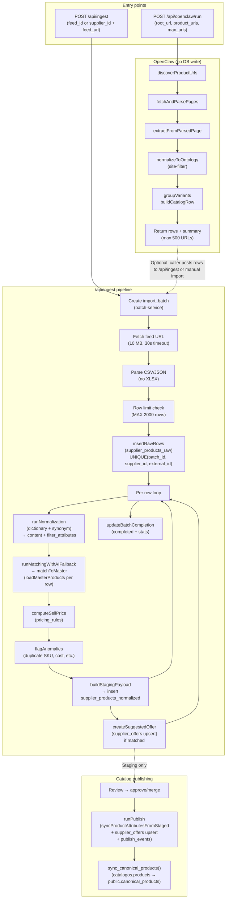

# GloveCubs — Product Ingestion Pipeline Large-Batch Audit

**Audit type:** Senior data ingestion engineer — large supplier catalog imports  
**Scope:** /api/ingest, /api/openclaw/run, canonical_products, supplier_offers, normalization, deduplication, AI, pack/price/image, publishing, error handling, transaction safety, performance  
**Date:** 2026-03-02

---

## 1. Ingestion flow diagram

**Data flow summary**

| Step | Component | Output / DB |
|------|-----------|-------------|
| 1 | POST /api/ingest | import_batches, supplier_products_raw, supplier_products_normalized, supplier_offers (suggested), import_batch_logs |
| 2 | POST /api/openclaw/run | In-memory rows + summary; **no** raw/staging insert |
| 3 | Publish (runPublish) | catalogos.products, product_attributes, supplier_offers, publish_events; then sync_canonical_products() → public.canonical_products |

**canonical_products:** Populated only by `catalogos.sync_canonical_products()` (RPC), which upserts from `catalogos.products`. Ingestion does not write to canonical_products directly; publish triggers sync.

---

## 2. Verification summary

### 2.1 Duplicate SKU handling

| Aspect | Behavior | Risk |
|--------|----------|------|
| **Same batch** | `supplier_products_raw` has `UNIQUE(batch_id, supplier_id, external_id)`. `external_id` = id/sku/item_number/product_id/item or `row_${index}`. Second row with same external_id **fails insert**; error collected; that row is **not** in rawIds so it is **skipped** for normalization and staging. | First row wins; duplicates in batch create gaps (no staging row for duplicate). Counts (raw_count vs rows in file) can differ. |
| **Cross-batch** | No deduplication at raw insert. Same supplier SKU in different batches creates multiple raw and staging rows. Matching may attach both to same master_product_id; supplier_offers upsert on (supplier_id, product_id, supplier_sku) updates one offer. | Acceptable; last batch wins for offer. |
| **In-batch duplicate flag** | `countSkuInBatch(sku, allSkus)`; if > 1, anomaly `duplicate_supplier_sku_in_batch` is added. Only the first occurrence gets a staging row (others fail at raw insert), so the flag appears only on that first row. | Logic correct; duplicate rows never reach staging. |

**Files:** `catalogos/src/lib/ingestion/raw-service.ts`, `anomaly-service.ts`, `run-pipeline.ts`; migration `20260311000001_catalogos_schema_full.sql` (uq_supplier_products_raw_batch_supplier_external).

### 2.2 Canonical product deduplication

| Aspect | Behavior | Risk |
|--------|----------|------|
| **Matching** | `matchToMaster`: UPC exact → SKU exact → attribute match (brand, material, color, size, thickness_mil, case_qty) → fuzzy title (≥0.5 word overlap). Confidence threshold 0.6. | Multiple staging rows can match same master; no duplicate master created. |
| **New masters** | New canonical (catalogos.products) are created only on **publish** when staging has no master_product_id and operator creates new master or on publish path that creates product. Pipeline does **not** create products; it only assigns master_product_id from existing products. | Safe: no auto-creation of masters during ingest; dedup is match-to-existing. |
| **supplier_offers** | Upsert on (supplier_id, product_id, supplier_sku). createSuggestedOffer checks existing offer and skips update if existing is from a **newer** batch (by batch created_at). | Prevents older batch overwriting newer offer. |

**Files:** `catalogos/src/lib/ingestion/match-service.ts`, `offer-service.ts`, `publish/publish-service.ts`.

### 2.3 Attribute normalization

| Aspect | Behavior | Risk |
|--------|----------|------|
| **Engine** | Dictionary-only: `runNormalization` → `extractDisposableGloveAttributes` / `extractWorkGloveAttributes` with synonym map (DB + fallback). Only allowed values (MATERIAL_VALUES, SIZE_VALUES, etc.); unmapped → review flags. | Consistent; no free-form values in filter attributes. |
| **Pack size** | Packaging from case_qty/box_qty + regex (1000/case, 100/box) → PACKAGING_VALUES (box_100_ct, case_1000_ct, etc.). Case qty used in pricing and attribute match. | Good for standard pack sizes; ambiguous rows get flags. |
| **Price** | `normalizeToCaseCost` (case-cost-normalization): parses basis (each/pack/box/case), packaging (boxes_per_case, eaches_per_box), computes normalized_case_cost; pricing_confidence and flags. | Sell-by-case enforced; conversion errors flagged. |
| **AI extraction** | **Not used** in main pipeline. run-pipeline uses `runNormalization` only. AI extraction exists in `runExtractionWithAIFallback` but is not called by run-pipeline. | Pipeline is deterministic; AI only used for **matching** fallback when rules confidence < threshold. |

**Files:** `catalogos/src/lib/normalization/normalization-engine.ts`, `extract-attributes-dictionary.ts`, `catalogos/src/lib/pricing/case-cost-normalization.ts`, `run-pipeline.ts`.

### 2.3b Image extraction

Images are taken from raw via `extractContentFromRaw`: `image_url`, `image`, `primary_image`, `img`, or `images` (string or array); array entries are filtered to URLs starting with `http`. First image is used for matching (image_url in NormalizedData). Missing image URL is flagged as anomaly `missing_image`. No AI or scraping; feed must supply URLs.

**Files:** `catalogos/src/lib/normalization/normalization-utils.ts`, `run-pipeline.ts` (normalizedDataFromResult), `anomaly-service.ts`.

### 2.4 Price-per-glove calculation

| Aspect | Behavior | Risk |
|--------|----------|------|
| **Case cost** | Normalized case cost is computed and stored (normalized_case_cost, pricing in content). Used for sell price (markup on case). | Correct for “price per case.” |
| **Per-glove** | No explicit “price per glove” or “price per unit” field computed in ingestion. Per-glove would be normalized_case_cost / eaches_per_case; eaches_per_case is in pricing result but not exposed as a dedicated “price_per_glove” in staging. | Missing only if UI/analytics need per-glove; not required for sell-by-case. |

**Files:** `catalogos/src/lib/pricing/case-cost-normalization.ts`, `normalization-engine.ts`, staging payload (normalized_data.pricing).

### 2.5 Pack size parsing

| Aspect | Behavior | Risk |
|--------|----------|------|
| **Raw fields** | case_qty, caseqty, qty_per_case, box_qty, pack_size, boxes_per_case, eaches_per_box, etc. | Multiple aliases supported. |
| **Normalized** | Packaging bucket: box_100_ct, box_200_250_ct, case_1000_ct, case_2000_plus_ct from numeric qty or text regex. Case qty used in attribute match and pricing. | Fragmentation low; unmapped values flagged. |

**Files:** `extract-attributes-dictionary.ts` (packaging), `case-cost-normalization.ts` (parsePackaging).

### 2.6 Ingestion error handling

| Aspect | Behavior | Risk |
|--------|----------|------|
| **Fetch** | Throws on non-2xx, timeout (30s), body > 10 MB. Batch marked failed; step logged. | Good. |
| **Parse** | Throws on parse failure; batch marked failed. | Good. |
| **Raw insert** | Per-row errors collected; failed rows omitted from rawIds; pipeline continues with successful rawIds only. Duplicate (batch, supplier, external_id) → error, row skipped. | Partial batch: some rows never normalized. |
| **Normalization** | Per-row try/catch; on exception, error pushed, rowResults.push(no normalizedId), continue. | Partial batch: some raw rows have no staging row. |
| **Staging insert** | On normErr, error pushed, continue. | Same. |
| **Offer** | createSuggestedOffer logs and returns false on error; pipeline does not abort. | Acceptable. |
| **API** | /api/ingest catch → logIngestionFailure, return 500 with stable message. | No raw stack to client. |

**Files:** `run-pipeline.ts`, `raw-service.ts`, `fetch-feed.ts`, `api/ingest/route.ts`.

### 2.7 Batch transaction safety

| Aspect | Behavior | Risk |
|--------|----------|------|
| **Single transaction** | **None.** No BEGIN/COMMIT/ROLLBACK around the batch. Raw insert is N single inserts; staging insert is N single inserts; offer upserts are per row. | **High:** Partial failure leaves batch in mixed state (e.g. 300 raw, 200 staging, 150 offers). No rollback of raw or staging on later failure. |
| **Idempotency** | Same feed run again creates new batch; new raw rows (same external_id in same batch would conflict). Re-running with same URL creates a new batch and new staging rows. | No automatic “skip already ingested” within a batch. |
| **Offer race** | createSuggestedOffer compares batch timestamps and skips if existing offer is newer. | Reduces overwrite of newer by older. |

**Files:** `run-pipeline.ts`, `batch-service.ts`, `raw-service.ts`. No RPC or server-side transaction wrapping the loop.

### 2.8 Ingestion performance

| Factor | Behavior | Risk for 500–1000 rows |
|--------|----------|-------------------------|
| **Row limit** | MAX_FEED_ROWS = 2000; feed truncated with warning. | 1000 rows in one batch is allowed; 1001+ truncated. |
| **Fetch** | 10 MB body, 30s timeout. | Large CSV can timeout or hit 10 MB. |
| **Memory** | Entire parsed.rows in memory; then per-row processing. | 1000 rows × ~few KB each is acceptable; 10k+ could be heavy. |
| **loadMasterProducts** | **Called inside matchToMaster for every row.** matchToMaster is invoked per row in runMatchingWithAIFallback. So **N round-trips** to load all products for the category (no caching in pipeline). | **Critical:** 500 rows = 500 × SELECT products; very slow and DB-heavy. |
| **AI matching** | When confidence < threshold, AI matching runs and may load candidates again (or use options.masterCandidates). Pipeline does not pass masterCandidates, so AI path also loads candidates per row. | Doubles candidate load when AI is used. |
| **Synonym map** | loadSynonymMap() once per batch. | OK. |
| **Pricing rules** | computeSellPrice loads pricing_rules per row. | N round-trips for rules. |
| **insertRawRows** | N single-row inserts. | Could be batched for speed. |
| **Staging insert** | N single-row inserts. | Same. |
| **maxDuration** | /api/ingest maxDuration = 60. | 500–1000 rows with N+1 matching can exceed 60s. |

**Files:** `run-pipeline.ts`, `match-service.ts`, `ai-orchestration.ts`, `pricing-service.ts`, `api/ingest/route.ts`.

---

## 3. OpenClaw and canonical_products

| Component | Role in ingestion |
|-----------|-------------------|
| **POST /api/openclaw/run** | Discovers and fetches product URLs (max 500), extracts and normalizes to ontology, returns rows + summary. **Does not** write to supplier_products_raw or supplier_products_normalized. Caller must post rows elsewhere (e.g. feed URL or manual import) to get them into staging. |
| **canonical_products** | `public.canonical_products` is the storefront search surface. Filled by `catalogos.sync_canonical_products()` (RPC), which upserts from catalogos.products. Invoked after runPublish in publish-service. Ingestion does not write to canonical_products. |
| **supplier_offers** | catalogos.supplier_offers: created/updated by createSuggestedOffer (during ingest) and by runPublish (on publish). Upsert key (supplier_id, product_id, supplier_sku). |

---

## 4. Weaknesses in the current system

1. **N+1 load of master products** — matchToMaster loads all category products for every row. For 500 rows and 500 masters, that is 500 identical heavy SELECTs. Should load once per batch and reuse.
2. **No batch transaction** — Partial failure leaves raw + partial staging + partial offers. No rollback; operator must reason about batch state and possibly re-run (new batch).
3. **Duplicate SKU in same batch** — Second and later rows with same external_id fail at raw insert and are skipped entirely (no staging). Counts and “duplicate” anomaly only reflect first occurrence.
4. **N single inserts** — Raw and staging inserts are one-by-one; no bulk insert. Slower for large batches.
5. **computeSellPrice per row** — Loads pricing_rules every time; could be cached per batch.
6. **OpenClaw disconnected** — OpenClaw output is not automatically fed into raw/staging; no single “run OpenClaw → ingest” path.
7. **60s maxDuration** — With N+1 matching, 500+ rows can exceed 60s and hit timeout.
8. **No price-per-glove field** — Not computed or stored if needed for display/analytics.
9. **AI extraction not in pipeline** — runNormalization only; AI extraction exists but is not used in run-pipeline (only AI matching is used when confidence is low).

---

## 5. Risks when importing 500+ products

| Risk | Likelihood | Impact | Mitigation |
|------|------------|--------|------------|
| **Timeout (60s)** | High for 500+ with current N+1 | Batch fails after partial work; no clear “resume” | Load masters once; bulk inserts; increase maxDuration or run async. |
| **Partial batch state** | High on any per-row failure | Mixed raw/staging/offers; hard to reason | Add batch-level transaction or “rollback batch” RPC; or accept and document. |
| **Duplicate SKU in file** | Medium | Fewer staging rows than rows in file; confusion | Document; optionally surface “skipped duplicate” count in result. |
| **DB load** | High (500+ SELECTs for products) | Slow ingest; DB CPU | Load master products once per batch; pass into matching. |
| **Memory** | Medium for 1000 rows | Node memory spike | Already capped at 2000 rows; consider streaming/chunking for very large. |
| **Offer overwrite** | Low | Newer batch can overwrite older offer (by design); older batch skip logic reduces opposite | Document; keep createSuggestedOffer timestamp check. |

---

## 6. Recommended improvements

**P0 (required for 500–1000 batch)**

1. **Load master products once per batch**  
   In run-pipeline, before the row loop, call `loadMasterProducts(categoryId)` once. Pass `masterCandidates` into runMatchingWithAIFallback so matchToMaster and AI matching reuse the same list. Removes N+1 and dramatically speeds up matching.

2. **Batch transaction or clear partial state**  
   Option A: Add an RPC that does raw insert + staging insert in one transaction (or two phases with rollback on staging failure). Option B: Keep current model but document “partial batch” and add a batch status like `partial` when error_count > 0; optionally support “retry failed rows” in a new batch.

**P1 (high value)**

3. **Bulk insert for raw and staging**  
   Use Supabase `.insert(rows)` with array of rows (in chunks of e.g. 100) instead of one-by-one for raw and for staging. Reduces round-trips.

4. **Cache pricing rules per batch**  
   Load pricing_rules once at start of batch; computeSellPrice(cost, categoryId, supplierId, productId) becomes in-memory lookup. Reduces N round-trips.

5. **Increase maxDuration or run async**  
   For 500–1000 rows, either raise maxDuration (e.g. 180) or move long runs to a job queue and return batch_id + “processing”; poll for completion.

6. **Duplicate SKU handling**  
   Either: (a) keep current (first wins, rest skip) and add `skipped_duplicate_count` to pipeline result and batch stats, or (b) allow multiple raw rows with same external_id (e.g. add sequence) and merge/dedupe at staging with clear policy.

**P2 (nice to have)**

7. **OpenClaw → staging**  
   Option to POST OpenClaw result (rows) to a new endpoint that creates a batch, inserts raw from rows, then runs normalize/match/stage so “run OpenClaw then ingest” is one flow.

8. **Price per glove**  
   If needed, compute and store e.g. `price_per_unit` = normalized_case_cost / eaches_per_case in staging or in product attributes.

9. **Optional AI extraction in pipeline**  
   If low-confidence extraction is desired, call runExtractionWithAIFallback when runNormalization confidence is below threshold (and AI_EXTRACTION_ENABLED); merge with dictionary result. Adds latency and cost.

---

## 7. Exact files / routes to change

| Priority | File / route | Change |
|----------|--------------|--------|
| P0 | `catalogos/src/lib/ingestion/run-pipeline.ts` | Before row loop: load master products once; pass masterCandidates into runMatchingWithAIFallback. |
| P0 | `catalogos/src/lib/ingestion/ai-orchestration.ts` | runMatchingWithAIFallback already accepts masterCandidates; ensure matchToMaster can accept pre-loaded list (or refactor match-service to accept optional candidates). |
| P0 | `catalogos/src/lib/ingestion/match-service.ts` | Add matchToMasterWithCandidates(candidates, input) or allow passing pre-loaded list so loadMasterProducts is not called when list provided. |
| P1 | `catalogos/src/lib/ingestion/raw-service.ts` | insertRawRows: bulk insert in chunks (e.g. 100) with .insert(rows). |
| P1 | `catalogos/src/lib/ingestion/run-pipeline.ts` | Staging: collect payloads and bulk insert in chunks. |
| P1 | `catalogos/src/lib/ingestion/pricing-service.ts` | Export loadRules(); run-pipeline loads once and passes cached rules or a pricing context. |
| P1 | `catalogos/src/app/api/ingest/route.ts` | maxDuration = 120 or 180; or return 202 + batch_id and process in background. |
| P2 | New route or OpenClaw integration | Accept OpenClaw rows and create batch + raw + run normalize/match/stage. |

---

## 8. Ready for real supplier imports?

**Verdict: NOT READY for 500–1000 product batches** in the current form.

**Reasons:**

- **Performance:** N+1 load of master products makes 500+ row batches slow and likely to hit the 60s timeout; DB load is unnecessary.
- **Transaction safety:** Partial failure leaves an inconsistent batch (some raw, some staging, some offers) with no rollback or clear recovery.
- **Scale:** Row limit 2000 and 10 MB feed are adequate, but without N+1 fix and possibly bulk inserts, 500–1000 rows in one go is unreliable.

**Ready for:**

- **50–200 row batches** with current code: feasible if suppliers are small; duplicate SKU in batch will skip rows; partial failure possible.
- **200–500** after **P0 only** (load masters once, optional batch transaction or documented partial state): reasonable.
- **500–1000** after **P0 + P1** (bulk inserts, pricing cache, longer timeout or async): realistic for production.

**Summary table**

| Check | Status | Note |
|-------|--------|------|
| Duplicate SKU handling | Partial | Same batch: first wins, rest skip at raw insert. Cross-batch: multiple staging rows, one offer. |
| Canonical product deduplication | OK | Match to existing only; no auto-create during ingest. |
| Attribute normalization | OK | Dictionary + synonym; pack size and price basis parsed. |
| Price-per-glove | Missing | Only case cost; per-glove derivable but not stored. |
| Pack size parsing | OK | Normalized packaging buckets + case qty in pricing. |
| Ingestion error handling | OK | Per-row try/catch; errors collected; no crash. |
| Batch transaction safety | Weak | No transaction; partial state on failure. |
| Ingestion performance | Weak | N+1 matching; single-row inserts; 60s limit. |

Implement **P0** (load masters once, optional transaction/partial-state handling) and re-test with 500-row batches; then add **P1** for 500–1000 production use.
