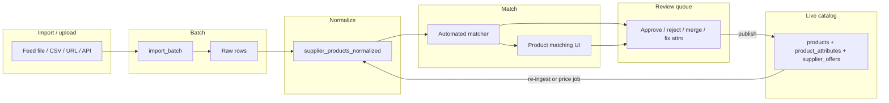

# Admin workflow design — GloveCubs catalog (CatalogOS)

This document defines **intended** catalog-admin workflows for GloveCubs: who does what, in what order, on which surfaces, and what system state changes. It is aligned with the **CatalogOS** Next.js admin under `catalogos/src/app/(dashboard)/dashboard/` and server actions in `catalogos/src/app/actions/review.ts`, while calling out **gaps** where UX or automation is still thin.

---

## 1. Scope and principles

**In scope:** Getting supplier data into a **normalized, publishable** catalog row; resolving identity (match / duplicate / variant family); correcting attributes and commercial fields; publishing to live `products` + `product_attributes` + `supplier_offers`; ongoing price and lifecycle maintenance.

**Out of scope (this doc):** Buyer quote/RFQ operations (separate queues), distributor crawl jobs (linked from nav as **Distributors**), pure CRM onboarding except where files feed ingestion.

**Design principles**

1. **Staging before live** — All changes from imports land in **normalized staging** (`supplier_products_normalized` in the review pipeline; legacy/simple list may still read `catalogos_staging_products` in places) until approved and published.
2. **Dictionary-grounded attributes** — Facets and validation come from the **attribute dictionary** per category; free text is limited (e.g. brand).
3. **Auditable decisions** — Approve, reject, merge, and resolution actions should write to **`review_decisions`** (or equivalent) with actor and timestamp.
4. **Idempotent publish** — Re-publish updates the same product/offer where possible (`runPublish` contract).
5. **Bulk where volume demands** — Ingestion console and review support batch-scoped bulk approve/publish; human review stays row- or small-batch–oriented for edge cases.

---

## 2. Information architecture (admin map)

Primary navigation (from `catalogos/src/app/(dashboard)/layout.tsx`):

| Area | Route(s) | Role in workflow |
|------|----------|------------------|
| Dashboard | `/dashboard` | Counts: suppliers, pending review, recent batches |
| Suppliers | `/dashboard/suppliers` | Supplier master; prerequisite for offers |
| Feeds | `/dashboard/feeds` | Scheduled/file feeds → batches |
| **Ingestion** | `/dashboard/ingestion`, `/dashboard/ingestion/[batchId]` | **Console of record** for batch health, review/publish shortcuts |
| AI CSV import | `/dashboard/csv-import` | Mapped CSV → pipeline |
| Batches | `/dashboard/batches`, `[id]` | Batch list/detail |
| Import monitoring | `/dashboard/imports`, `[id]` | Long-running import observability |
| **Staging** | `/dashboard/staging` | Simple staged row list (status filters) |
| **Review queue** | `/dashboard/review`, `?id=`, `/dashboard/review/[id]` | **Match review, attribute correction, merge, category, pricing overrides** |
| **Publish-ready** | `/dashboard/publish` | Approved rows awaiting `publishStagedToLive` / bulk publish |
| Master products | `/dashboard/master-products` | Canonical SKU list (narrative: sync from publish) |
| Discovery | `/dashboard/discovery/...` | Lead intake (supplier expansion) |
| Catalog expansion | `/dashboard/catalog-expansion/...` | Sync runs, lifecycle, discontinued |
| **Product matching** | `/dashboard/product-matching`, `runs/[id]` | **Matcher runs, uncertain candidates, duplicate pairs** |
| **Operations** | `/dashboard/operations` | Cross-queue summary (stale, blocked, duplicates) |
| Onboarding | `/dashboard/onboarding/...` | Supplier onboarding + **file handoffs** |
| URL import | `/dashboard/url-import/...` | URL crawl jobs → preview → pipeline |

---

## 3. End-to-end lifecycle

---

## 4. Workflow: Import / upload

**Goal:** Create an **import batch** with traceable stats (raw → staged) and route operators to the right queue.

**Channels (today):**

- **Feeds** (`/dashboard/feeds`) — Upload or connect supplier files; ties to `source_type: feed`.
- **AI CSV import** (`/dashboard/csv-import`) — Column mapping + validation before pipeline.
- **URL import** (`/dashboard/url-import`) — Crawl jobs with preview.
- **API / workers** — Batches may appear without a UI action (documented in ops runbooks).

**Operator workflow**

1. Choose channel → start import → note **batch id**.
2. Open **Ingestion Console** (`/dashboard/ingestion`) for that batch: failed rows, duplicate warnings, `review_required_rows`, accepted vs published counts.
3. If failures: fix source or mapping; re-run or partial re-ingest per pipeline docs.
4. If success with review required: go to **Review queue** filtered by batch (see `docs/catalogos/REVIEW_DASHBOARD.md`).

**Design targets**

- Single **“Add data”** hub that links Feeds, CSV, URL, and API tokens (reduce nav scatter).
- Batch detail always shows **next action**: “N rows need review”, “M approved unpublished”, “K failed”.

---

## 5. Workflow: Staging queue

**Goal:** Operators see **all non-live normalized rows** with status, batch, and confidence; can open the review sheet quickly.

**Current surfaces**

- **Staging** (`/dashboard/staging`) — Table by `catalogos_staging_products` with Pending/Approved/All; link to review.
- **Review queue** (`/dashboard/review`) — Rich filters (supplier, batch, category, status, confidence, anomalies, missing attributes, unmatched).
- **Ingestion batch detail** — Batch-scoped staging stats and bulk affordances.

**States (conceptual)**

| Status | Meaning | Typical next step |
|--------|---------|-------------------|
| `pending` | Not decided | Match, edit attributes, approve/reject/merge |
| `approved` | Linked to master; ready to publish | Publish (single or bulk) |
| `merged` | Additional offer merged onto existing master | Publish to attach/update offer |
| `rejected` | Discarded | None, or archive |

**Design targets**

- Unify naming if two tables (`catalogos_staging_products` vs `supplier_products_normalized`) confuse operators; one mental model: **“normalized staging”**.
- Default sort: **oldest pending first** within batch SLA buckets (surfaced on **Operations** as stale staged).

---

## 6. Workflow: Match review

**Goal:** Confirm or correct **which master product** a supplier row represents (or create a new master).

**Automated path**

- Run **Product matching** (`/dashboard/product-matching`) against a completed batch → creates a **match run** with stats (matched / uncertain / no_match / duplicates).
- **Match run detail** (`runs/[id]`): lists candidates needing review and **duplicate candidates** with scores.

**Human path (Review queue detail)**

- Open row → see raw vs normalized, proposed `master_product_id`, confidence, anomalies.
- Actions (from `review.ts`): **Approve match**, **Create new master product** (inserts into `products` and approves row), **Merge with…** (`mergeWithStaged`), **Reject**, **Mark for reprocessing** (reset match).

**Design targets**

- **Side-by-side** diff: supplier title/SKU vs master title/SKU + key facets (material, size, mil).
- **Keyboard-first** triage for high-volume batches (approve / next).
- Clear **SLA badge** when confidence &lt; threshold or duplicate warning.

---

## 7. Workflow: Attribute correction

**Goal:** Fix normalized facet values **before** publish so storefront facets stay clean.

**Mechanism**

- `updateNormalizedAttributes(normalizedId, attributes)` merges into `normalized_data.filter_attributes` / `attributes` and validates against **`getReviewDictionaryForCategory`** (allowed values; multi-select rules).
- `getAttributeRequirementsForStaged` exposes **required**, **strongly preferred**, and allowed values for the review UI.

**Operator workflow**

1. Filter review queue: **missing attributes** or **has anomalies**.
2. Open detail sheet → edit fields constrained by dictionary (invalid values return explicit errors).
3. Optionally **assign category** first if dictionary context is wrong (`assignCategory`).

**Design targets**

- Inline **“required for publish”** checklist on the detail sheet (driven by dictionary).
- Suggest values from **synonym / extraction** history where safe (already partially in normalization engine).

---

## 8. Workflow: Product merge / split

### Merge (implemented direction)

**Meaning:** Multiple supplier rows (or staged rows) should attach to **one** master product as multiple offers or consolidated identity.

- **Merge with staged** — `mergeWithStaged(normalizedId, targetMasterProductId)` sets status `merged`, logs decision; optional `publishToLive` to push offer.
- **Bulk approve** — `bulkApproveStaged` with same `masterProductId` for many rows.
- **Duplicate candidates** (product matching) — Operator picks **keep / merge** via duplicate actions (pairs of live or near-live products).

**Operator workflow**

1. Identify duplicates (matcher duplicate list, or review anomalies).
2. Choose **surviving master** → merge staged rows or resolve duplicate candidate.
3. Publish so **`supplier_offers`** reflect all sources on one `product_id`.

### Split (design — partially supported by “new master” / resolution)

**Meaning:** One published product incorrectly combines distinct sellable items (e.g. wrong variant lumping).

**Target workflow**

1. **Identify** — Ops flags from duplicate tooling, returns, or buyer confusion.
2. **Detach** — Create **new** `products` row (or use resolution graph) and **reassign** specific offers / staged rows to the new master (today: create new master from a staged row; live-only split may need a dedicated **“split product”** action).
3. **Re-publish** — Run publish for each row; **deactivate** or **re-attribute** the old product if empty.

**Gap:** First-class **split wizard** (select offers to move → new SKU/slug) is not described as a single screen in the current dashboard; treat as **P1** if merge volume is high.

---

## 9. Workflow: Publish / unpublish

### Publish

** Preconditions:** Row `approved` or `merged` with `master_product_id`; required attributes satisfied (`runPublish` / validation modes).

**Paths**

- From approval: `approveMatch(..., { publishToLive: true })` (and equivalents on create/merge).
- Explicit: **`publishStagedToLive(normalizedId)`** after approval.
- Bulk: **`bulkPublishStaged`**, **`publishAllApprovedInBatch`** (chunked, max caps in `review.ts`).

**Effects (intended)** — Per `publish-service.ts`: upsert live product, sync **`product_attributes`**, upsert **`supplier_offers`**, emit publish event; supports **images** array from staged content when present.

### Unpublish

**Goal:** Remove or hide a product from the storefront without deleting history.

**Target behavior**

- Set **`products.is_active = false`** (and optionally clear featured flags); storefront lists already filter `is_active`.
- Optionally **deactivate offers** or mark **discontinued** in lifecycle (catalog expansion).

**Gap:** Dedicated **“Unpublish product”** admin action and audit trail may be missing as a first-class button; document as **required** for compliance and seasonal assortment.

---

## 10. Workflow: Image / spec upload

### Images

**Ingestion-time:** Staged `normalized_data` may include **`images: string[]`** URLs; `buildPublishInputFromStaged` passes them into publish (`stagedContent.images`).

**Design workflow**

1. Supplier onboarding **files** or crawl extracts URLs → normalization stores them on the row.
2. Review: **preview gallery** + replace/remove broken URLs.
3. Publish: write through to product media model (exact storage depends on schema: URLs vs bucket keys).

**Gap:** A dedicated **“Catalog media”** uploader (drag-drop to tenant storage with CDN) may not exist; operators may rely on supplier URLs until improved.

### Specs (datasheets, SDS, co-man docs)

**Target workflow**

1. Attach **documents** to **supplier** or **product** with type tags (SDS, spec sheet, cert).
2. Store in object storage; show on PDP for B2B buyers (optional storefront).

**Gap:** Wire in onboarding file downloads vs product-level spec library; unify under **product attachments** table.

---

## 11. Workflow: Supplier pricing updates

**Sources**

- **New ingestion** — Same SKU path updates `normalized_data` cost/sell fields → re-publish updates offer.
- **Review overrides** — `overridePricing(normalizedId, sellPrice)` sets **`override_sell_price`** in `normalized_data` for margin control.
- **Automated guards** — See `docs/DAILY_PRICE_GUARD.md` / QA supervisor patterns: thresholds for auto-publish vs review queue.

**Operator workflow**

1. Price-only batch lands → ingestion shows **accepted** rows.
2. If within policy: **bulk publish** or automated job.
3. If spike/drop: filter **anomalies** in review → approve with override or reject.

**Design targets**

- **Diff view**: old vs new case cost, % change, sell price impact.
- Tie to **supplier contract** effective dates (future: price list versioning).

---

## 12. Workflow: Variant editing

**Goal:** Maintain **size/color/pack** grain consistent with `product-types` `variantDimensions` and URL-import **family grouping**.

**Implemented backend hook**

- **`publishVariantGroup(normalizedIds, …)`** — Publishes a **family** of normalized rows sharing `family_group_key` (after inference); see `runPublishVariantGroup`.

**Operator workflow (target)**

1. After URL import or batch ingest, run **family inference** (if not automatic).
2. Review **family preview**: list of sizes in group; fix stragglers.
3. **Publish variant group** in one action → one family, N variant products, N offers.

**Gaps**

- Dedicated **“Variant editor”** on live products (add/remove size, fix pack qty) may be limited; prefer **staged correction + re-publish** until a live editor exists.
- Storefront variant picker is separate (see `docs/customer-catalog-ux-audit.md`).

---

## 13. Workflow: Category assignment

**Goal:** Every publishable row has a **category_id** / slug aligned with registry and dictionary.

**Mechanisms**

- **assignCategory(normalizedId, categoryId)** — Writes `category_id` into `normalized_data` for downstream dictionary validation.
- **createNewMasterProduct** — Includes `category_id` on insert into `products`.
- Matcher and normalization may propose `category_slug` from content.

**Operator workflow**

1. Filter **unmatched** or **wrong facet set** (symptom of wrong line).
2. Assign category → attribute form refreshes allowed values → fix attributes → approve/publish.

**Design targets**

- **Category change on live product** — Should re-sync `product_attributes` and invalidate storefront caches; may require explicit **“Apply category change”** job if not only via staging.

---

## 14. Roles and permissions (recommended)

| Role | Import | Review / edit | Publish | Unpublish | Matching runs | Ops dashboards |
|------|--------|---------------|---------|-----------|---------------|----------------|
| **Catalog analyst** | Yes | Yes | No | No | Yes | Read |
| **Catalog manager** | Yes | Yes | Yes | Yes | Yes | Read |
| **Ops / automation** | API only | Bulk approve high confidence | Bulk publish | No | Trigger | Full |
| **Read-only** | No | View | No | No | View | View |

Enforcement should live in **auth middleware** + RLS; UI should hide destructive actions.

---

## 15. Metrics and health

- **Ingestion console cards**: needs review batches, ready to publish, failed, duplicate warnings.
- **Operations command center**: pending sync promotions, promoted unreviewed, blocked by missing attrs, discontinued, duplicate warnings, stale staged/sync ages.
- **Dashboard home**: pending staging count, recent batches.

**Design target:** Per-batch **Funnel**: raw → normalized → matched → approved → published, with drop-off reasons.

---

## 16. Gap summary (prioritized)

| Priority | Gap | Recommendation |
|----------|-----|----------------|
| P0 | **Unpublish** not prominent in reviewed UI | Add product-level deactivate + audit; optional offer deactivate |
| P0 | **Split product** for live catalog | Wizard: move offers to new master, re-slug |
| P1 | Staging **dual-table** mental load | Consolidate UI on `supplier_products_normalized` + clear migration note |
| P1 | **Publish-ready** page actions | Bulk “Publish all” with progress and error export |
| P1 | **Image/spec** central upload | Tenant storage + review preview |
| P2 | **Search within review queue** | By SKU, supplier, title |
| P2 | **Keyboard triage** | Approve / defer / reject shortcuts |

---

## 17. Appendix — Key server actions (review)

From `catalogos/src/app/actions/review.ts` (representative):

- `approveMatch`, `rejectStaged`, `createNewMasterProduct`, `mergeWithStaged`, `deferStaged`
- `updateNormalizedAttributes`, `overridePricing`, `assignCategory`, `markForReprocessing`
- `publishStagedToLive`, `bulkPublishStaged`, `publishAllApprovedInBatch`
- `bulkApproveStaged`, `bulkRejectStaged`, `bulkMarkForReview`, `approveAllAboveConfidence`
- `approveResolutionCandidateAction`, `rejectResolutionCandidateAction`
- `publishVariantGroup`

**Publish pipeline:** `catalogos/src/lib/publish/publish-service.ts` (`runPublish`, `buildPublishInputFromStaged`).

**Further reading:** `docs/catalogos/REVIEW_DASHBOARD.md`, `docs/catalogos/PUBLISHING_AND_STOREFRONT_ARCHITECTURE.md`, `docs/catalogos/NORMALIZATION_ENGINE.md`, `docs/DAILY_PRICE_GUARD.md`.

---

*This is a living design doc. Update when new dashboard routes or actions ship.*
