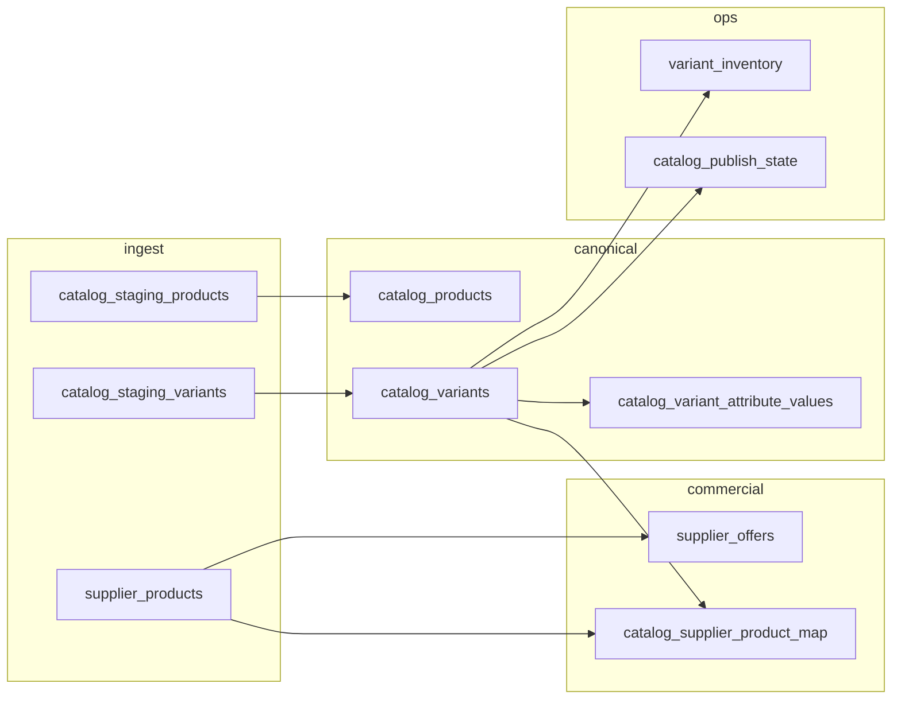

# Catalog schema v2 (`catalog_v2`)

This document describes the **additive** catalog model introduced alongside legacy `public.products` and existing `catalogos.*` ingestion tables. Nothing in v2 replaces those systems yet; applications can migrate reads/writes incrementally.

**Migration file:** `supabase/migrations/20260331100001_catalog_v2_additive_schema.sql`

**Schema name:** `catalog_v2` — keeps UUID-first canonical tables clearly separated from `public.products` (BIGINT legacy) and from `catalogos.products` / `public.canonical_products` (current publish/search paths).

---

## Design principles

1. **Canonical product vs sellable variant** — Customers buy **variants** (concrete SKU); marketing and navigation often group by **product** (parent PDP).
2. **Supplier truth is separate** — `supplier_products` + `supplier_offers` hold vendor identity and commercial terms; **mapping** to internal variants is explicit (`catalog_supplier_product_map`).
3. **Inventory follows the variant** — `variant_inventory` is keyed by `catalog_variant_id`, not the legacy product row.
4. **Staging and review** — Ingest lands in `catalog_staging_*`, optional human gate in `catalog_match_reviews`, then promotion to canonical tables.
5. **Observability** — `catalog_events` (outbox/stream) and `catalog_audit_log` (who/when/what) support async integrations and compliance.

All new primary keys are **UUIDs** (`gen_random_uuid()` via `pgcrypto`).

---

## Table reference

| Table | Role |
|--------|------|
| `catalog_v2.catalog_product_types` | Product **lines** or families (e.g. disposable nitrile, cut-resistant work glove). Hierarchical via `parent_type_id`. New lines add a type + attribute definitions without breaking old rows. |
| `catalog_v2.catalog_products` | **Canonical parent** — name, slug, brand, type, optional `legacy_public_product_id` → `public.products`. Holds merchandising identity shared by variants. |
| `catalog_v2.catalog_variants` | **Sellable SKU** — `variant_sku` unique, optional GTIN/MPN, `attribute_signature` for matching/dedup. |
| `catalog_v2.catalog_attribute_definitions` | **Schema per product type** — which attributes exist, filter/search flags, variant axes (size, color, …). |
| `catalog_v2.catalog_variant_attribute_values` | **EAV values** per variant + definition; indexed for facet/filter queries. |
| `catalog_v2.supplier_products` | **Supplier-side identity** — `supplier_id` → `catalogos.suppliers`, optional `source_batch_id` → `catalogos.import_batches`, `raw_attributes` JSONB. |
| `catalog_v2.supplier_offers` | **Pricing & terms** — unit cost, MOQ, lead time, effective dating; many rows per `supplier_product_id` for history. |
| `catalog_v2.catalog_supplier_product_map` | **Bridge** — one primary `catalog_variant_id` per `supplier_product_id` (enforced unique). |
| `catalog_v2.variant_inventory` | **Stock** per variant + `location_code` (default `'default'`). |
| `catalog_v2.catalog_product_images` | **Parent-level** images (PDP gallery not specific to one SKU). |
| `catalog_v2.catalog_variant_images` | **Variant-level** images (e.g. color-specific). |
| `catalog_v2.catalog_publish_state` | **Go-live** per variant + **channel** (e.g. `storefront`); distinct from `is_active` on the variant row. |
| `catalog_v2.catalog_staging_products` | **Raw/normalized ingest** parents before promotion; `promoted_catalog_product_id` when merged. |
| `catalog_v2.catalog_staging_variants` | **Staging variants** under a staging product; `promoted_catalog_variant_id` when merged. |
| `catalog_v2.catalog_match_reviews` | **Review queue** — ties `supplier_product` and/or `staging_variant` to a proposed `catalog_variant`; status workflow. |
| `catalog_v2.catalog_events` | **Domain events** — append-only; `processed_at` NULL = pending consumer (search, webhooks, etc.). |
| `catalog_v2.catalog_audit_log` | **Audit trail** — actor, entity, action, optional before/after JSON. |

---

## Data flow: staging → canonical → variant → inventory → pricing → customer

1. **Ingest** — Feeds or pipelines write `supplier_products` (+ optional `supplier_offers`) and/or `catalog_staging_products` / `catalog_staging_variants` with `raw_payload` / `raw_attributes`.
2. **Normalize & match** — Jobs propose `catalog_supplier_product_map` and/or open `catalog_match_reviews` when confidence is low.
3. **Canonicalize** — Approved staging promotes to `catalog_products` + `catalog_variants`; attribute rows materialize in `catalog_variant_attribute_values` from definitions for that `product_type_id`.
4. **Inventory** — WMS or sync jobs update `variant_inventory` by `catalog_variant_id`.
5. **Pricing (B2B / offers)** — Best offer selection uses `supplier_offers` joined through `supplier_products` → map → variant (application logic or future views).
6. **Customer-facing** — Only variants with `catalog_publish_state.is_published` for the relevant channel should appear in storefront APIs; legacy `public.products` / `canonical_products` can stay authoritative until cutover.

---

## How future product lines fit

- Add a **`catalog_product_types`** row (or subtree under a parent type).
- Add **`catalog_attribute_definitions`** for that type (new axes, filters, search fields).
- New **`catalog_products`** reference the new type; **variants** inherit the definition set.
- **Supplier feeds** continue to populate `supplier_products`; mapping rules can be scoped by `product_type` or supplier without altering old types.

No need to alter legacy `public.products` schema to onboard a new line in v2.

---

## Relationships to existing GloveCubs objects

| Existing | Relationship to v2 |
|----------|---------------------|
| `public.products` | Optional `catalog_products.legacy_public_product_id` for straddle migrations. |
| `public.manufacturers` | Optional FK on `catalog_products.manufacturer_id`. |
| `catalogos.suppliers` | Required FK for `supplier_products.supplier_id`. |
| `catalogos.import_batches` | Optional provenance on `supplier_products`, `catalog_staging_products`. |
| `catalogos.brands` | Optional FK on `catalog_products.brand_id`. |
| `catalogos.*` / `public.canonical_products` | Unchanged; v2 is parallel until you add sync jobs or views. |

---

## Indexes and constraints (summary)

- **Uniqueness:** `catalog_product_types.code`, `catalog_products.slug`, `catalog_variants.variant_sku`, `(product_type_id, attribute_key)`, `(catalog_variant_id, attribute_definition_id)`, `(catalog_variant_id, location_code)`, `(catalog_variant_id, channel)` on publish state, partial uniques on `(supplier_id, external_id)` and `(supplier_id, supplier_sku)` when not null, one map row per `supplier_product_id`.
- **Search / filter:** GIN on `catalog_products` name/description tsvector; GIN on `supplier_products.raw_attributes`; B-tree indexes on foreign keys and filter columns (`value_text`, `value_number`, offer effective dates, staging status).

---

## Operational notes

- **RLS:** Not enabled in the initial migration; treat `catalog_v2` as service-role / trusted backend until policies are added (mirror `catalogos` RLS patterns if exposing via Supabase client).
- **Order of apply:** Run after `catalogos.suppliers`, `catalogos.import_batches`, `catalogos.brands`, and `public.manufacturers` / `public.products` exist (standard GloveCubs migration order).

---

## Related documentation

- [catalog-migration-backfill.md](./catalog-migration-backfill.md) — legacy `public.products` → `catalog_v2` backfill, compat view, env flag
- `docs/MIGRATION_ORDER.md` — repository migration sequencing
- `supabase/migrations/20260404000001_canonical_products_table_and_sync.sql` — current storefront sync path
- `supabase/migrations/20260311000001_catalogos_schema_full.sql` — CatalogOS baseline
