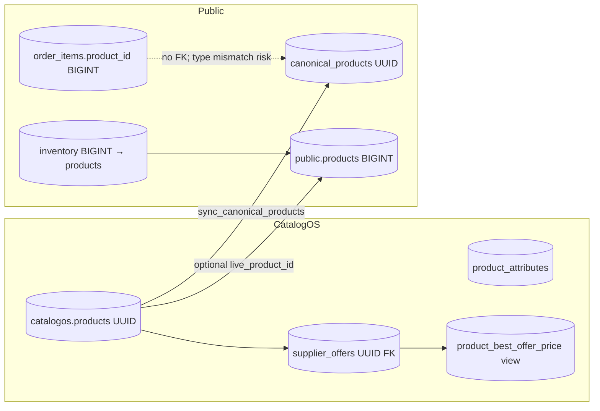

# GloveCubs — Full-Stack Schema & Sync Audit

**Role:** Production auditor — database → types → services → APIs → UIs  
**Focus:** New catalog schema / migration layer (`catalogos.*`, `catalog_v2.*`, `public.canonical_products`, legacy `public.products`) and cross-layer drift  
**Date:** 2026-03-02

---

## Executive summary

The stack runs **multiple product identity models in parallel** without a single enforced join path from “customer-facing product id” through **orders, inventory, and cart**. **CatalogOS** (Next app `catalogos/`) correctly uses **UUID** `catalogos.products` + `product_attributes` + `product_best_offer_price`. **Storefront** search and buyer product pages use **`public.canonical_products`** (UUID, synced from `catalogos.products`). **Legacy commerce tables** (`public.order_items`, `public.inventory`) still assume **`BIGINT` `public.products.id`**, with **no FK** on `order_items.product_id`. **`catalogos/src/lib/db/types.ts`** still describes **obsolete BIGINT** `catalogos_*` mirror tables and does **not** reflect live `catalogos` schema types.

**`catalog_v2`** (additive migrations `20260331100001_*` … `20260331100004_*`) introduces **UUID** canonical products, variants, and offers **alongside** legacy `public.products` and existing `catalogos.*` — **application code is largely not migrated** to `catalog_v2`; risk of **triple mapping** (catalogos vs public.products vs catalog_v2).

---

## 1. Critical bugs

| ID | Issue | Evidence / impact |
|----|--------|-------------------|
| **C1** | **`order_items.product_id` is `BIGINT` with no FK** while live catalog identity for search/buyer PDP is **`canonical_products.id` (UUID)**. Storing a UUID in a BIGINT column is invalid; storing legacy `public.products.id` diverges from catalogos/canonical id for the same SKU. | `supabase/migrations/20260330000002_glovecubs_orders_carts_inventory.sql` (`product_id BIGINT NOT NULL`); buyer PDP uses UUID `canonical_products` (`storefront/src/app/buyer/products/[id]/page.tsx`). |
| **C2** | **`public.inventory` references `public.products(id)` BIGINT only.** Published catalog lives in **`catalogos.products` (UUID)** + sync to **`canonical_products`**. Inventory rows do not track catalogos UUID; **inventory is tied to the wrong entity** for anything published only through CatalogOS. | Same migration file: `inventory.product_id BIGINT REFERENCES products(id)`. |
| **C3** | **`runPublish` (canonical publish path) does not update `catalogos.products.live_product_id` or upsert `public.products`.** Schema and comments still describe **`live_product_id` → `public.products`**. Only **`publish-staging-catalogos.ts`** writes `public.products` and `live_product_id` — that path is **not** the canonical API/review publish path. | `catalogos/src/lib/publish/publish-service.ts` ends with `sync_canonical_products` RPC only; `catalogos/src/lib/services/publish/publish-staging-catalogos.ts` contains `public.products` upsert + `live_product_id` update. |
| **C4** | **Generated TypeScript DB types are stale:** `catalogos/src/lib/db/types.ts` models **`public.catalogos_*` tables with `number` (BIGINT) ids**, while **`getSupabaseCatalogos()`** uses **`catalogos.import_batches`**, **`supplier_products_normalized`**, etc. with **UUID** strings. Any code importing `Database` from this file for CatalogOS rows will **mis-type ids and joins**. | Compare `types.ts` (`catalogos_import_batches.id: number`) with `catalogos/src/lib/review/data.ts` (`.from("import_batches")` UUID). |
| **C5** | **Two parallel `supplier_offers` concepts:** **`catalogos.supplier_offers`** (used by CatalogOS + `public.supplier_offers` **view**) vs **`catalog_v2.supplier_offers`** (different grain: `supplier_product_id`). Code that assumes one model can **join wrong table** after partial migration. | `20260331100001_catalog_v2_additive_schema.sql`; `20260404000002_public_views_for_storefront_search.sql`. |

---

## 2. Data integrity risks

| ID | Risk | Detail |
|----|------|--------|
| **D1** | **Orphan order lines** | Orders reference BIGINT `product_id` that may not exist in `public.products` or may duplicate a different UUID product in canonical. |
| **D2** | **Split brain: same logical product, three ids** | `catalogos.products.id` (UUID), `public.canonical_products.id` (should match after sync), `public.products.id` (BIGINT). Without strict `live_product_id` maintenance on every publish, **reports and joins break**. |
| **D3** | **Sync lag / failure** | `sync_canonical_products()` runs after `runPublish`; failures are logged (`observability`) but **publish still returns success**. Storefront search can be **missing or stale** vs catalogos. |
| **D4** | **Variant vs product** | `catalogos.products.family_id` + staging family columns (`20260601000001_product_families_and_variant_staging.sql`) vs **`catalog_v2.catalog_variants`**. UI and matching may treat **size variants as separate masters** or conflate **family vs variant** depending on code path. |
| **D5** | **Cart payload** | `public.carts.items` is **JSONB** — if clients store BIGINT vs UUID `product_id`, **checkout cannot reliably join** to `canonical_products` or `catalogos.products`. |

---

## 3. Performance risks

| ID | Risk | Detail |
|----|------|--------|
| **P1** | **N+1 or unbounded loads** | Ingestion `matchToMaster` loads full category product list **per row** (see `INGESTION_PIPELINE_LARGE_BATCH_AUDIT.md`) — large catalogs slow **all** layers that depend on timely sync. |
| **P2** | **Heavy views** | `catalog_v2.v_products_legacy_shape` uses **multiple correlated subqueries** per row — fine for small result sets; **risky as primary read path** at scale. |
| **P3** | **Filter path** | CatalogOS `product_attributes` + `product_best_offer_price` are indexed in migrations; **verify** `idx_supplier_offers_product` and attribute indexes exist in every environment. |
| **P4** | **FTS / trigram on canonical_products** | Storefront search depends on `canonical_products` + RPCs; **missing analyze or bad stats** → slow search under load. |

---

## 4. Launch blockers

| ID | Blocker | Why |
|----|---------|-----|
| **L1** | **Orders/inventory vs catalog identity** | If launch takes **buyer traffic** on `canonical_products` (UUID) but **orders** still require **BIGINT `public.products`**, you cannot safely record **what was purchased** without a **single mapping table** or schema migration. |
| **L2** | **Types / codegen** | Shipping with **`catalogos/src/lib/db/types.ts`** as the source of truth **will mislead** engineers and static checks; **blocker for safe refactors**. |
| **L3** | **`live_product_id` drift** | If any reporting or Express paths still expect **`public.products`** to mirror **`catalogos.products`**, **canonical-only publish** breaks that assumption. **Decide one bridge strategy** and enforce it in publish. |

---

## 5. Layer-by-layer drift (reference)

### 5.1 Database schema (authoritative shapes)

| Surface | Product id type | Notes |
|---------|-----------------|--------|
| `public.products` | **BIGINT** | Legacy row; slug, cost, attributes JSONB, etc. |
| `catalogos.products` | **UUID** | Master catalog for CatalogOS; `live_product_id BIGINT?` → `public.products` |
| `public.canonical_products` | **UUID** | Synced from `catalogos.products` (`sync_canonical_products`); storefront search / buyer PDP |
| `catalog_v2.catalog_products` / `catalog_variants` | **UUID** | Additive; `legacy_public_product_id` optional |
| `catalogos.supplier_offers.product_id` | **UUID** | FK to `catalogos.products` |
| `public.supplier_offers` | **VIEW** | Over `catalogos.supplier_offers`; `product_id` UUID |
| `public.order_items.product_id` | **BIGINT** | **No FK** |
| `public.inventory.product_id` | **BIGINT** | **FK → `public.products`** |

### 5.2 Types

| Location | Problem |
|----------|---------|
| `catalogos/src/lib/db/types.ts` | **Legacy BIGINT `catalogos_*` public tables** — not aligned with `Accept-Profile: catalogos` UUID schema. |
| `catalogos` app code | Generally uses `string` for UUID ids in services (correct by convention); **not** enforced by generated `Database` type. |
| `storefront` | `ProductSearchResult.product_id: string` — aligns with canonical UUID **if** RPC returns UUID strings consistently. |

### 5.3 Mappers / duplicated logic

| Area | Files / pattern |
|------|-----------------|
| Canonical → search facets | `storefront/src/lib/catalog/canonical-read-model.ts` (`mapCanonicalRowToSearchFacets`, `searchFacetsToLegacyAttributes`) |
| CatalogOS list items | `catalogos/src/lib/catalog/query.ts` (`LiveProductItem`, `product_best_offer_price`) |
| **Duplication** | Two read models for “product + price + facets” — **must stay in sync** on field names (`glove_type` vs `primary_variant_style`, `product_line_code`). |

### 5.4 Services & API routes

| Component | Schema used |
|-----------|-------------|
| POST `/api/ingest` | `catalogos.*` UUID pipeline |
| POST `/api/publish` | `runPublish` → `catalogos.products`, `product_attributes`, `supplier_offers`, `sync_canonical_products` |
| Storefront `productSearch.ts` | `canonical_products` + views over `catalogos` |
| CatalogOS `/api/catalog/*` | `catalogos.products` + `product_attributes` + `product_best_offer_price` |
| Buyer product page | `canonical_products` by UUID |

### 5.5 Admin UI vs customer UI

| App | Product source |
|-----|----------------|
| CatalogOS dashboard | `import_batches`, `supplier_products_normalized`, review, publish → **catalogos** |
| Storefront admin products | Often **`public.products`** (`storefront/src/app/admin/products/page.tsx`) — **not** the same as `catalogos.products` |
| Storefront buyer | **`canonical_products`** |

### 5.6 Cart / orders / pricing / inventory

| Concern | Current state |
|---------|----------------|
| **Cart** | CatalogOS: **`QuoteBasketContext`** / `basket-store` — **`productId: string`** (UUID-aligned). Storefront server carts: **JSONB** — shape not enforced. |
| **Orders** | **`order_items.product_id BIGINT`** — **misaligned** with UUID catalog. |
| **Pricing** | **Source of truth for list price:** `catalogos.supplier_offers.sell_price` / `cost`, aggregated in **`product_best_offer_price`**. Public view **`COALESCE(sell_price, cost) AS price`**. **Do not** use only `public.products.cost` for merchandising if catalogos is authoritative. |
| **Inventory** | **`public.inventory` → BIGINT `products`** — **wrong entity** for catalogos-only catalog. |
| **Search / filters** | Storefront: canonical + token parsers + `product_line_code`. CatalogOS: **`product_attributes`** value_text + definitions. **Different column sources** for “material/size/color” — drift if sync omits columns. |

---

## 6. Null handling & wrong-field risks

- **Price:** Trust **`sell_price` when set**, else **`cost`** (view + `offerPrice()` in `catalogos/src/lib/catalog/query.ts`). Null `sell_price` is intentional fallback — UI must not show “$0” if cost is null; validate at publish.
- **Search filters:** `glove_type` marked **deprecated** in `ProductSearchResult` — code still mapping old fields can **filter on empty** columns.
- **`canonical_products` columns** (`material`, `size`, …) populated from **`p.attributes` JSONB** in sync — if publish doesn’t populate `catalogos.products.attributes`, **facets appear empty** even when `product_attributes` has rows (CatalogOS filters use **`product_attributes`**, not necessarily the same as JSON snapshot on canonical).

---

## 7. Exact file-level fixes required

### P0 — Data model integrity

| File / area | Action |
|-------------|--------|
| `supabase/migrations/*` (new migration) | **Choose one:** (a) Alter `order_items.product_id` to **UUID** + FK to `canonical_products(id)` or `catalogos.products(id)`, with backfill from `live_product_id` / SKU map; or (b) Add **`catalog_product_id UUID`** column + keep BIGINT deprecated; migrate writers. |
| `public.inventory` | Repoint to **UUID** product key consistent with canonical, or maintain **`inventory_by_catalog_product`** bridge. |
| `catalogos/src/lib/publish/publish-service.ts` | If `public.products` remains required: **upsert `public.products` and set `catalogos.products.live_product_id`** after catalogos product write (mirror old `publish-staging-catalogos` behavior), **or** formally deprecate `public.products` for new SKUs and update all readers. |
| `catalogos/src/lib/db/types.ts` | **Replace** with Supabase-generated types from **actual** schema (catalogos profile + public), or **delete** misleading `Database` and document codegen command. |

### P1 — Drift reduction

| File / area | Action |
|-------------|--------|
| `storefront/src/app/admin/products/*` | Document whether admin edits **legacy `products`** or should call **CatalogOS / sync**; avoid two sources of truth for same SKU. |
| `storefront/src/lib/search/productSearch.ts` + `catalogos/src/lib/catalog/query.ts` | **Single spec** for facet field names (`product_line_code`, material, size) — shared package or generated contract. |
| `catalog_v2` | **Either** wire application to `catalog_v2` with a cutover plan **or** document “schema only — not in runtime path” to prevent accidental joins to `catalog_v2.supplier_offers`. |

### P2 — Performance & ops

| File / area | Action |
|-------------|--------|
| `catalogos/src/lib/ingestion/run-pipeline.ts` | Load master products **once per batch** (see ingestion audit). |
| DB | Confirm indexes on `supplier_offers(product_id)`, `product_attributes(product_id, attribute_definition_id)`, `canonical_products` FTS/GIN per storefront migrations. |

---

## 8. Ingestion flow vs catalog v2 (clarification)

- **`/api/ingest`** → **`catalogos`** pipeline (UUID batch/staging/products/offers). **Does not** write `catalog_v2`.
- **`/api/openclaw/run`** → returns rows for **manual** import; **does not** auto-insert into `catalog_v2` or `catalogos` staging.
- **`catalog_v2`** backfill migration exists (`20260331100003_*`) — **runtime apps reviewed here still center on `catalogos` + `canonical_products`**, not `catalog_v2` reads.

---

## 9. Diagram: identity & price (simplified)

---

## 10. Verdict

| Question | Answer |
|----------|--------|
| Is the stack synchronized? | **No.** Multiple product IDs (UUID vs BIGINT), **stale TS types**, **optional `live_product_id` bridge not updated on canonical publish**, and **additive `catalog_v2`** without app-wide adoption. |
| Safe for production orders tied to catalog? | **Not until `order_items` / inventory align** with **`canonical_products` or `catalogos.products` UUID** (or a tested mapping layer). |
| Search/filter using wrong fields? | **Possible** where storefront uses **denormalized canonical columns** while CatalogOS storefront uses **`product_attributes`** — same product can **facet differently** across apps if sync JSON and attribute rows diverge. |

**Next step:** Run a **one-time audit query** in production (after backup): compare counts and SKU overlap among `catalogos.products`, `canonical_products`, and `public.products`; sample **order_items.product_id** joinability to each. Use results to prioritize **P0** migration order.

---

*This audit is based on repository migrations and application code as of the audit date; production DB may have manual drift — verify with `information_schema` and Supabase schema diff.*
