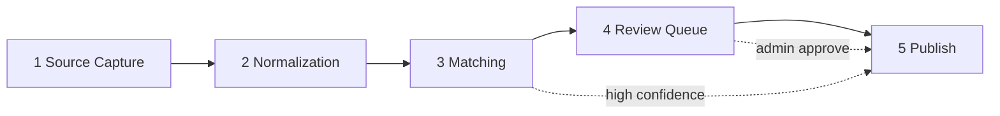

# Ingestion & normalization pipeline architecture

This document defines a **five-stage** ingestion model for GloveCubs so new product lines can be onboarded with consistent capture → normalize → match → review → publish flows. It aligns with existing code under `lib/ingestion/` and `services/ingestionService.js`, and with additive tables in `catalog_v2` (see [catalog-schema-v2.md](./catalog-schema-v2.md)).

---

## Goals

| Goal | How |
|------|-----|
| **Auditable transformations** | Every stage emits structured events and/or rows in `catalog_v2.catalog_audit_log`; optional `catalog_v2.catalog_events` for async consumers. |
| **No raw → published writes** | Published catalog (`catalog_products`, `catalog_variants`, `supplier_offers`, search read models) is updated **only** from Stage 5 after staging + policy (auto or reviewed). |
| **Centralized normalization** | Single module (or small package) owns text + taxonomy rules; callers never duplicate trim/synonym logic. |
| **Easy new product lines** | New lines = new `catalog_product_types` + attribute definitions + synonym rows + optional type-specific normalizers (plug-in pattern). |
| **Dictionary / synonyms** | DB-backed or version-controlled dictionary for manufacturer, material, size, UOM; normalization always resolves through it. |

---

## High-level flow

- **Low-confidence or incomplete** rows stop at Stage 4 until a human or rule override clears them.
- **High-confidence** paths may skip UI review per tenant policy (still logged).

---

## Stage 1 — Source capture

**Purpose:** Immutable (or append-only) record of **what** arrived, **from where**, with stable **deduplication**.

### Responsibilities

| Concern | Description |
|---------|-------------|
| Raw supplier record | Opaque row as received (JSONB / blob pointer). |
| Raw payload | Full body for replay and debugging. |
| Source URL / file | Provenance: feed URL, storage key, upload id. |
| Idempotency key | Stable key per logical message: e.g. hash(`supplier_id` + `external_id` + `payload_version`) or explicit header. |
| Source identifiers | Supplier SKU, GTIN, MPN, vendor `external_id`. |

### Suggested persistence (target)

Today, overlap exists with:

- `catalogos_raw_supplier_products` / import batch flows (legacy CatalogOS).
- `catalog_v2.supplier_products` (normalized supplier identity after capture).
- `catalog_v2.catalog_staging_products` (`raw_payload`, `source_batch_id`, `checksum`).

**Target pattern:** introduce or extend a dedicated **capture** entity so Stage 1 is never confused with Stage 2+:

- Option A — **New table** `catalog_v2.ingestion_source_records` (recommended in a follow-up migration):  
  `id`, `supplier_id`, `idempotency_key` **UNIQUE**, `source_uri`, `raw_payload`, `source_external_ids` (jsonb), `captured_at`, `content_hash`.
- Option B — **Use** `catalog_v2.supplier_products` only after normalization: keep raw-only rows in `ingestion_source_records` and link `supplier_products.source_record_id` (FK) once normalized identity exists.

### Audit

- Insert = one `catalog_audit_log` row: `action = 'ingestion.capture'`, `entity_type = 'ingestion_source_record'`, `after_data` = `{ idempotency_key, supplier_id, content_hash }` (not necessarily full payload in audit if too large — store pointer).

---

## Stage 2 — Normalization

**Purpose:** Deterministic, testable transformation from raw → **canonical-shaped** fields + **product type** + **confidence**.

### Responsibilities

| Step | Output |
|------|--------|
| Normalize text fields | Trim, Unicode NFKC, collapse whitespace, title rules for display vs search keys. |
| Normalize manufacturer | Map via synonym dictionary → `manufacturers` / `catalogos.brands` id or canonical string. |
| Normalize material | Map nitrile/nitril/NBR → canonical material code. |
| Normalize size / dimensions | Parse “LG”, “Large”, “9.5” → canonical size tokens + optional numeric mm/inches. |
| Normalize packaging / unit | Case vs each, `pack_qty`, UOM (EA, CS, BX) via dictionary. |
| Extract structured attributes | Populate a **normalized DTO** matching `catalog_attribute_definitions` for the assigned type. |
| Assign product type | Choose `catalog_product_types` (e.g. `legacy_glove`, `disposable_nitrile`, …). |
| Confidence scoring | Per-field and aggregate scores (0–1); reasons array (which rules fired). |

### Centralization rule

**All** normalization MUST live in one place:

- **Code:** e.g. `lib/ingestion/normalize/` (split by concern: `text.js`, `manufacturer.js`, `material.js`, `size.js`, `packaging.js`, `attributes.js`, `productType.js`, `score.js`) with a single entry `normalizeIngestRecord(input) -> NormalizedRecord`.
- **No** ad-hoc `.trim()` + string compares in route handlers or one-off CSV scripts for catalog-bound data.

Current code to converge: `lib/ingestion/pipeline.js`, `validator.js`, `extractor.js` — refactor callers to use the centralized normalizer and emit scores + reasons.

### Persistence (target)

- Update `catalog_v2.catalog_staging_products`: `status` transitions `pending` → `normalizing` → `ready` | `rejected`.
- Store **normalized snapshot** in `raw_payload` sibling column (recommended migration): `normalized_payload JSONB` + `normalization_confidence JSONB` + `normalization_version TEXT` (semver of ruleset).
- `catalog_v2.catalog_staging_variants` similarly holds per-variant normalized payloads.

### Audit

- For each normalization run: `catalog_audit_log` with `action = 'ingestion.normalize'`, `before_data` / `after_data` **diffs** at field level (or hash of before/after for large payloads).
- Append `catalog_events` event `NormalizedIngestRecord` for downstream analytics.

---

## Stage 3 — Matching

**Purpose:** Link supplier identity to **internal** catalog without polluting published tables on uncertainty.

### Responsibilities

| Step | Description |
|------|-------------|
| Match to catalog product | Compare normalized title/brand/GTIN family to `catalog_products` (+ metadata rules). |
| Match to variant | Match size/color/pack axes to `catalog_variants` + attribute values. |
| Candidate product | If no product match, create **staging** candidate (not `catalog_products` until publish). |
| Match confidence | Numeric score + breakdown by signal (GTIN, SKU regex, embedding, manual hint). |
| Match reasons | Structured list: `{ "signal": "gtin", "weight": 0.4 }`, etc. |

### Persistence

- `catalog_v2.catalog_supplier_product_map`: link `supplier_products` → `catalog_variants` when confident.
- `catalog_v2.catalog_match_reviews`: queue when confidence &lt; threshold or conflicting candidates.
- Store **reasons** in map `match_method` + JSONB metadata (extend migration if only `match_confidence` exists today).

### Rules

- **Never** insert into `catalog_products` / `catalog_variants` here — only staging + map proposals + review rows.

### Audit

- `catalog_audit_log`: `action = 'ingestion.match'`, `entity_id` = staging or supplier_product id, `after_data` = `{ proposed_variant_id, confidence, reasons }`.

---

## Stage 4 — Review queue

**Purpose:** Human or policy gate for exceptions.

### Enters queue when

- Low aggregate confidence from Stage 3.
- Missing required attributes for the assigned `product_type`.
- Conflicting matches (two variants above threshold).
- New product type with `review_required = true` (config per type).

### Existing / target tables

- `catalog_v2.catalog_match_reviews` (`review_status`, `resolution_notes`, `reviewed_by`).
- Admin UI: surface staging row + proposed match + **editable normalized fields**; on save, re-run Stage 3 (subset) or advance to Stage 5.

### Audit

- `catalog_audit_log`: `action = 'ingestion.review_decision'`, `after_data` = `{ review_id, decision, editor }`.

---

## Stage 5 — Publish

**Purpose:** Materialize **durable** catalog and commercial rows and refresh **read models**.

### Operations (order)

1. **Upsert** `catalog_v2.catalog_products` / `catalog_variants` (and attribute values, images).
2. **Upsert** `catalog_v2.supplier_products` / `catalog_v2.supplier_offers` (if not already done post-match).
3. **Update** `catalog_v2.catalog_publish_state` per channel.
4. **Refresh** search/filter surface: e.g. `public.canonical_products` sync, `catalogos.sync_canonical_products()`, or future v2-only materialized views — **single job** per publish batch.

### Hard rule

Publish job reads **only** from staging + approved match outcome + normalization snapshot — **not** from raw capture without passing Stage 2–4 gates.

### Audit

- `catalog_audit_log`: `action = 'ingestion.publish'`, `entity_type` = `catalog_product` / `catalog_variant`, payload summary.
- `catalog_events`: `CatalogPublished` for search indexers / webhooks.

---

## Dictionary & synonym system

### Scope

| Domain | Examples |
|--------|----------|
| Manufacturer / brand | "Halyard Health" ↔ "Halyard", typos |
| Material | nitrile, NBR, vinyl, latex |
| Size | S/M/L/XL, glove numerics, mil thickness |
| UOM | bx, box, case, cs, ea |
| Product type hints | Keywords → `catalog_product_types.code` |

### Storage options

1. **DB table** `catalog_v2.ingestion_synonyms` (recommended):  
   `domain`, `alias TEXT`, `canonical_key TEXT`, `priority INT`, `active BOOLEAN`, unique (`domain`, lower(`alias`)).
2. **Versioned JSON** in repo for CI/CD (load into DB on migrate).
3. **Hybrid:** seed JSON → DB, editable in admin for hotfixes.

### Usage

- Normalization functions **only** resolve through `resolveSynonym(domain, raw)` which loads from cache (Redis) or DB with TTL.
- **Tests** must cover synonym tables + edge cases (empty, multiple matches — highest priority wins).

---

## Auditing summary

| Mechanism | Use |
|-----------|-----|
| `catalog_v2.catalog_audit_log` | Compliance-style trail: actor, entity, action, optional before/after. |
| `catalog_v2.catalog_events` | Async pipeline, replay, metrics. |
| `catalogos.import_batches` / batch stats | Operational run boundaries (existing). |
| `normalization_version` | Tie-break which ruleset produced a row. |

---

## Testing strategy

### Normalization (Stage 2)

- **Unit tests:** `tests/ingestion-normalize.test.js` (current: `schema` + `validator`); extend with `lib/ingestion/normalize/__tests__/` as logic moves behind a single normalizer module.
  - Text: trim, NFKC, forbidden chars.
  - Manufacturer / material / size / UOM: table-driven cases from CSV or JSON fixtures.
  - Product type: keyword routing for 3+ types.
  - Confidence: known-good vs known-bad inputs produce expected score bands.

### Matching (Stage 3)

- **Unit tests:** pure functions with fake catalog rows in memory.
  - GTIN exact match → high confidence.
  - SKU prefix rules (e.g. `GLV-`) → documented behavior.
  - Ambiguous size → lower confidence → review queue flag.

### Integration (optional)

- Test DB: capture → normalize → match → publish on a **transaction rollback** fixture or ephemeral schema.

---

## Mapping: current code → stages

| Current | Stage |
|---------|--------|
| CSV upload / API receiving payload | 1 (extend with idempotency + dedicated capture table) |
| `lib/ingestion/pipeline.js` + `validator.js` | 2 (consolidate into `normalize/*`) |
| `services/ingestionService.js` → `catalogos_staging_products` | 2–3 bridge; migrate toward `catalog_v2` staging |
| Manual approve / merge in admin | 4 |
| Publish to `products` / `canonical_products` | 5 (dual-write during migration, then v2-first) |

---

## Adding a new product line (checklist)

1. Add `catalog_v2.catalog_product_types` row (and parent hierarchy if needed).
2. Add `catalog_v2.catalog_attribute_definitions` for that type.
3. Seed synonyms for materials/sizes/UOM specific to that line.
4. Register a **product type classifier** (rules or ML) in `normalize/productType.js`.
5. Configure match rules (GTIN/SKU patterns) in `matching/` config.
6. Set `review_required` policy for the type until volume stabilizes.
7. Add normalization + matcher tests for the new line’s fixtures.

---

## Risk areas

| Risk | Mitigation |
|------|------------|
| Silent duplicate products | Enforce idempotency at Stage 1; unique keys on capture + supplier external id. |
| Drift between services | Single `normalization_version` and shared test fixtures. |
| Large payloads in audit | Store hash + storage URL in `catalog_audit_log`, not full JSON. |
| Bypassing staging | All write paths to published catalog go through one publish service; code review + lint rule forbidding direct `insert` into `catalog_products` from ingest routes. |

---

## Related documents

- [catalog-schema-v2.md](./catalog-schema-v2.md) — v2 tables and data flow.
- [catalog-migration-backfill.md](./catalog-migration-backfill.md) — legacy `products` bridge.
- [MIGRATION_ORDER.md](./MIGRATION_ORDER.md) — SQL migration order.

---

## Next implementation steps (engineering backlog)

1. Migration: `catalog_v2.ingestion_source_records` + `catalog_v2.ingestion_synonyms` (or equivalent).
2. Refactor: extract `normalizeIngestRecord` from `lib/ingestion/pipeline.js` into `lib/ingestion/normalize/` with tests.
3. Wire `ingestionService` to write capture → staging v2 → audit log.
4. Implement publish orchestrator calling existing sync (`catalogos.sync_canonical_products`) and future v2 search builders.
5. Admin UI: review queue backed by `catalog_match_reviews` + editable normalized payload.

This document is the **source of truth** for stage boundaries and audit rules; update it when schema or module layout changes.
