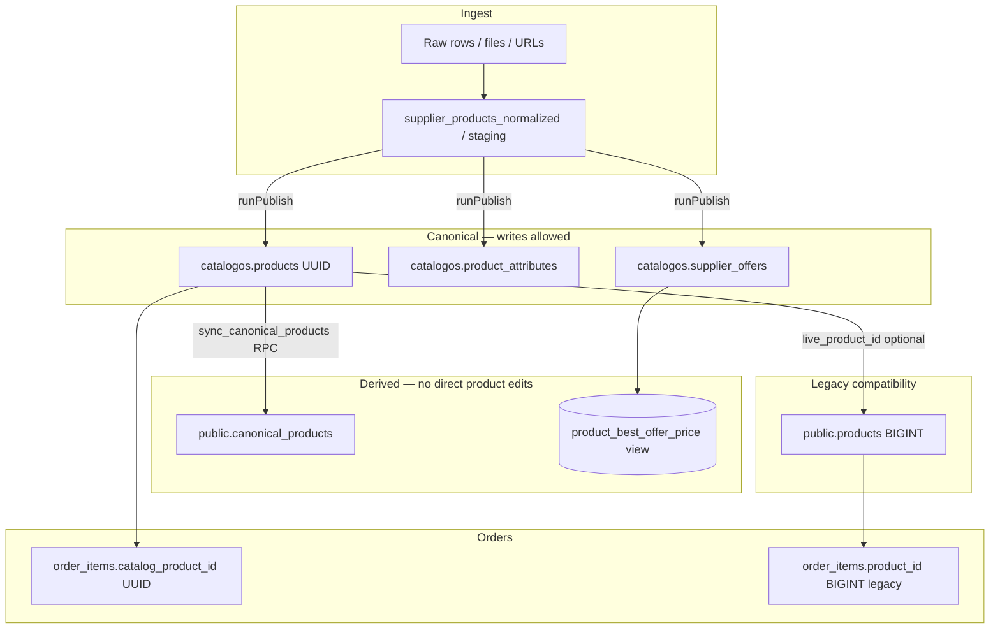

# Single source of truth — GloveCubs catalog architecture

This document **defines one coherent model** for product data across `public.products`, `public.canonical_products`, `catalogos.products`, and `catalog_v2.*`, and describes the end-to-end flow **raw ingest → staging → canonical → storefront → orders**.

It reflects the **current production wiring** (migrations under `supabase/migrations/`, publish code in `catalogos/src/lib/publish/publish-service.ts`) and states **target direction** where schemas are intentionally parallel (e.g. `catalog_v2`).

---

## 1. Executive decisions

| Question | Decision |
|----------|----------|
| **Which table is the canonical product?** | **`catalogos.products`** (UUID primary key). All publish and lifecycle truth for the CatalogOS pipeline lives here. |
| **Which table represents sellable variants?** | **Today (CatalogOS path):** the **sellable SKU is the same grain as `catalogos.products`** — one published row = one storefront product / one primary offer family key. **Target:** **`catalog_v2.catalog_variants`** (and `catalog_v2.catalog_products` as parent) when the v2 cutover completes; until then, “variant groups” are modeled as **multiple `catalogos.products` rows** plus optional `publishVariantGroup` flows. |
| **What is `public.canonical_products`?** | A **derived, read-optimized projection** for storefront search and jobs. **Not** an editor-owned source. Rows use the **same UUID as `catalogos.products.id`**. Populated **only** via `catalogos.sync_canonical_products()` (plus triggers on that table). |
| **What should happen to `public.products`?** | **Deprecate for new catalog writes.** Keep the table (or eventually a **compat view**) for **legacy BIGINT IDs** on historical orders/inventory and the optional FK **`catalogos.products.live_product_id` → `public.products.id`**. New features must not create “truth” only in `public.products`. |
| **What is `catalog_v2` today?** | An **additive, UUID-first target schema** (`catalog_products`, `catalog_variants`, supplier map, staging, events). It is **not** the operational SOT until ingestion and publish are cut over. See `docs/catalog-schema-v2.md`. |

---

## 2. Reference model (one diagram)



**Rule of thumb:** If an operator or job “creates a product,” the **first durable write** must land in **`catalogos.products`** (and related catalogos tables). Anything in `public.canonical_products` or legacy `public.products` is **downstream**.

---

## 3. Layer-by-layer definitions

### 3.1 Raw ingest

- **Inputs:** Supplier feeds, CSV/AI import, URL crawl, API ingest.
- **Outputs:** Raw rows (e.g. batch-scoped), then **normalized staging** such as **`catalogos.supplier_products_normalized`** (review queue), with pointers to supplier, batch, and raw id.

**Truth level:** *Candidate* — not customer-visible until approved and published.

### 3.2 Staging

- Staging holds **normalized_json / normalized_data**, match confidence, proposed `master_product_id`, and status (`pending`, `approved`, `merged`, `rejected`).
- Human and automated matchers update staging; **no storefront listing** should read staging as the primary catalog.

### 3.3 Canonical (authoritative)

| Entity | Table | Role |
|--------|--------|------|
| Product (UUID) | **`catalogos.products`** | SKU, slug, name, description, `category_id`, `brand_id`, `is_active`, `published_at`, optional **`live_product_id`**, JSON **`attributes`** (denormalized bag) |
| Facets / dictionary | **`catalogos.product_attributes`** | Normalized EAV for storefront filters and publish validation (keys tied to `attribute_definitions`) |
| Commercial truth | **`catalogos.supplier_offers`** | Per-supplier SKU, cost, sell_price, lead time, `product_id` FK to `catalogos.products` |
| Best display price | **`product_best_offer_price`** (view) | Aggregated best price / offer count per `product_id` — **read model** for listing/PDP pricing |
| Audit | **`catalogos.publish_events`** | Staging row → product publish trail |

**Canonical product = `catalogos.products`.**  
**Sellable variant (current model) = same row** unless you have explicitly modeled multiple UUID products for one family; **`catalog_v2.catalog_variants`** is the long-term variant SOT.

### 3.4 Storefront projection

| Surface | Consumes | Notes |
|---------|----------|--------|
| **Next CatalogOS storefront** (`catalogos/`) | `catalogos.products`, `product_attributes`, view `product_best_offer_price` | Faceted browse in app code (`listLiveProducts`, etc.) |
| **Express / storefront app search** | **`public.canonical_products`**, **`search_products_fts`**, joins to **`supplier_offers`** | Full-text + trigram on `canonical_products`; pricing from offers in SQL |

`public.canonical_products` is documented in migrations as the **live list synced from `catalogos.products`**:

```30:30:supabase/migrations/20260404000001_canonical_products_table_and_sync.sql
COMMENT ON TABLE public.canonical_products IS 'Live product list for storefront search; synced from catalogos.products. Run catalogos.sync_canonical_products() to refresh.';
```

### 3.5 Orders

- **Preferred join:** `order_items.catalog_product_id` → **`catalogos.products.id`** / **`canonical_products.id`** (same UUID), per additive migrations such as `20260626100000_order_inventory_catalog_product_uuid.sql`.
- **Legacy:** `order_items.product_id` → **`public.products.id`** (BIGINT); bridge via **`catalogos.products.live_product_id`** when backfilling UUIDs.

---

## 4. How `runPublish` updates canonical + storefront

`runPublish` in `catalogos/src/lib/publish/publish-service.ts` is the **single write orchestrator** from approved staging to live catalog. In order:

1. **Validate** staged attributes (`publish_safe` / `stage_safe`) for the category.
2. **Upsert `catalogos.products`** — update existing `masterProductId` or insert new row (`sku`, `name`, `category_id`, `slug`, `description`, `brand_id`, `published_at`, …).
3. **`syncProductAttributesFromStaged`** — writes **`catalogos.product_attributes`** from staged filter attributes (dictionary-aligned).
4. **Upsert `catalogos.supplier_offers`** — one row per `(supplier_id, product_id, supplier_sku)` with cost/sell_price and lineage (`raw_id`, `normalized_id`).
5. **Insert `catalogos.publish_events`**.
6. **Best-effort lifecycle** updates for catalog expansion sync items (`setLifecycleStatus`).
7. **Refresh storefront projection:** `await supabase.rpc("sync_canonical_products")` — upserts **`public.canonical_products`** from **`catalogos.products`** for active rows.

On **`canonical_products`**, the storefront migration installs a **BEFORE INSERT OR UPDATE** trigger that recomputes **`search_vector`** from name, title, sku, material, glove_type, size, category (see `storefront/supabase/migrations/20260312000002_product_search.sql`). So **search indexes update automatically** when the RPC writes/updates `canonical_products`.

**Failure handling:** If `sync_canonical_products` fails, publish can still succeed for catalogos tables; observability logs the failure (`sync_canonical_products_failure`). **Ops should treat that as a broken storefront search slice** until sync is retried (cron or manual RPC).

### 4.1 Important consistency note (`products.attributes` vs `product_attributes`)

- **Faceted CatalogOS queries** use **`product_attributes`** (joined via attribute definitions).
- **`sync_canonical_products`** copies **`catalogos.products.attributes` JSONB** and derived text columns (`material`, `size`, …) from that JSON **and** explicit columns on `products`.

`syncProductAttributesFromStaged` **does not** (by itself) rebuild `catalogos.products.attributes` from the EAV table. If `products.attributes` JSON is stale while `product_attributes` is fresh, **Express/search projection on `canonical_products` can drift** from the Next storefront facets.

**Architecture requirement (pick one and enforce in code):**

- **Option A (minimal change):** Extend **`runPublish`** (or a post-sync step) to **merge** staged filter attributes into **`catalogos.products.attributes`** JSON whenever `product_attributes` is synced; **then** call `sync_canonical_products`.
- **Option B (DB-centric):** Change **`catalogos.sync_canonical_products()`** to **derive** denormalized facet columns from **`product_attributes`** (aggregate by key) instead of from JSON only.

Until one of these is enforced, treat **dual-attribute storage** as a known risk area.

---

## 5. Search indexes — who owns what

| Index / artifact | Location | Updated when |
|------------------|----------|--------------|
| **`canonical_products.search_vector`** | Postgres GIN | Trigger on **`canonical_products`** insert/update (after RPC sync) |
| Trigram indexes on name/title/sku | `canonical_products` | Static indexes; row updates refresh indexed values |
| **`search_products_fts`** | SQL function | Reads **`canonical_products`** + **`supplier_offers`** at query time |
| CatalogOS app search param `q` | Application | Must query **`catalogos.products`** / attributes (today: ensure implementation matches product doc; wire `q` into `listLiveProducts` if not already) |

**Principle:** After every successful publish that should affect **Express** search, **`sync_canonical_products` must run** so triggers refresh `search_vector`.

**Future (catalog_v2):** Outbox pattern — `catalog_v2.catalog_events` → worker updates OpenSearch/Meilisearch/pgvector; same rule: **events emitted from canonical writes**, not from legacy tables.

---

## 6. How pricing joins in

```text
catalogos.supplier_offers.product_id  →  catalogos.products.id
                ↓
   product_best_offer_price (view)     →  best_price, offer_count per product
                ↓
   Storefront listing / PDP             →  display price (sell vs cost rules in app)
```

- **Authoritative commercial rows:** **`catalogos.supplier_offers`** (multiple suppliers per product).
- **Customer-facing “one number”:** Computed in SQL (**view**) or app (**`offerPrice`** semantics in CatalogOS).
- **`public.canonical_products`** does not need to duplicate price for correctness if search SQL joins offers (as in `search_products_fts`); keep pricing **joinable by UUID** `id = product_id`.

**Do not** treat `public.products.cost/price` columns as SOT for new pricing; they are **legacy** shapes where they still exist.

---

## 7. `public.products` — deprecate writes, keep compatibility

**Today**

- **`catalogos.products.live_product_id`** optionally links UUID catalog rows to **legacy BIGINT** `public.products.id` (FK after hardening migration).
- Historical **orders / inventory** may still reference **`public.products`**.

**Policy**

| Use case | Allowed |
|----------|---------|
| New catalog creation | **No** — use **`catalogos.products`** + publish |
| Historical order display | **Yes** — read legacy id |
| Backfill UUID on order lines | **Yes** — via `live_product_id` map |
| New integrations writing only `public.products` | **No** — redirect to ingest → staging → publish |

**End state:** `public.products` becomes **read-only** or a **`catalog_v2.v_products_legacy_shape`–style view** for APIs that still expect BIGINT rows, while **all mutations** go through catalogos (or v2).

---

## 8. `catalog_v2` — target SOT, not current

When cutover happens:

- **`catalog_v2.catalog_products`** = canonical **parent** (merchandising).
- **`catalog_v2.catalog_variants`** = **sellable SKU** (inventory, MPN/GTIN, variant axes).
- **Supplier truth** = `catalog_v2.supplier_products` + `supplier_offers` + **`catalog_supplier_product_map`**.
- **Publish** should emit **events** for search and downstream systems.

Until then, **operational SOT remains `catalogos.products` + `product_attributes` + `catalogos.supplier_offers`**, with **`public.canonical_products`** as the **search projection** for the Express storefront.

---

## 9. Anti-patterns to eliminate

1. **Writing `public.canonical_products` directly** from admin UIs (e.g. URL import paths that bypass catalogos) — creates a **second catalog**; see `docs/CATALOG_INGESTION_FILTER_LAUNCH_AUDIT.md`.
2. **Treating `public.products` as the master** for new SKUs.
3. **Skipping `sync_canonical_products`** after publish — breaks search freshness and `search_vector`.
4. **Assuming `products.attributes` JSON matches `product_attributes`** without a defined sync rule.

---

## 10. Checklist for engineers

- [ ] New feature joins **`catalogos.products.id`** (UUID) for product identity.
- [ ] Publish path always calls **`sync_canonical_products`** (or equivalent batch job) after catalog mutations that should appear in Express search.
- [ ] Price display uses **`supplier_offers`** / **`product_best_offer_price`**, not legacy product price columns.
- [ ] Order lines prefer **`catalog_product_id`**; use legacy `product_id` only for pre-migration rows.
- [ ] Any new “second product table” is rejected unless it is explicitly a **projection** with a documented sync from **`catalogos.products`** or **`catalog_v2`**.

---

## 11. File references

| Topic | Location |
|-------|----------|
| `sync_canonical_products` (current shape with `product_line_code`) | `supabase/migrations/20260327100000_product_line_registry.sql` |
| Initial `canonical_products` + sync | `supabase/migrations/20260404000001_canonical_products_table_and_sync.sql` |
| `runPublish` + RPC call | `catalogos/src/lib/publish/publish-service.ts` |
| Attribute EAV sync | `catalogos/src/lib/publish/product-attribute-sync.ts` |
| Search trigger + `search_products_fts` | `storefront/supabase/migrations/20260312000002_product_search.sql` |
| catalog_v2 schema | `supabase/migrations/20260331100001_catalog_v2_additive_schema.sql`, `docs/catalog-schema-v2.md` |
| Order UUID columns | `supabase/migrations/20260626100000_order_inventory_catalog_product_uuid.sql` |
| Migration order (one DB) | `docs/MIGRATION_ORDER.md` |

---

*This document is normative for architecture discussions; update it when `catalog_v2` becomes the write path or when `sync_canonical_products` / attribute denormalization changes.*
