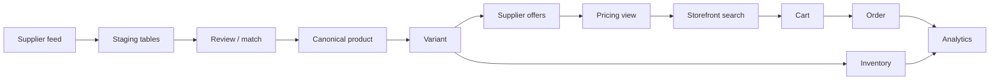

# Single source of truth — long-term architecture & cutover plan

**Status:** Normative reference for GloveCubs catalog and commerce.  
**Companion:** [`single-source-of-truth-architecture.md`](./single-source-of-truth-architecture.md) (current wiring and `runPublish` detail).

This document defines the **target** data model, **who reads/writes what** today vs after cutover, an **end-to-end data flow**, and a **phased migration** with risks and rollback.

---

## A. Problem statement

Multiple product surfaces exist today:

| Surface | Typical use today | Risk |
|---------|------------------|------|
| `public.products` | Legacy BIGINT product id, historical rows | Checkout/reporting drift vs UUID catalog |
| `public.canonical_products` | Express/storefront search, jobs | Treated as editable by some UIs; can diverge from `catalogos.products` |
| `catalogos.products` | CatalogOS publish, Next storefront listings | JSON `attributes` vs `product_attributes` EAV drift |
| `catalog_v2.*` | Additive schema, partial backfill | Parallel truth if apps write here without sync |
| `catalogos.supplier_offers` | Commercial rows | Correct join key; must stay aligned to canonical `product_id` |
| `product_best_offer_price` | Aggregated listing price | View only — safe if offers are SOT |
| `public.inventory` + `canonical_product_id` | Stock patched to UUID | Dual keys (`product_id` BIGINT + UUID) until inventory moves to variant grain |

**Failure modes:** search on one table, checkout on another, admin editing a third, pricing from a fourth, attributes split across JSON and EAV without a single write path.

---

## B. Target architecture (long-term SOT)

### B.1 Canonical product identity (long-term)

**`catalog_v2.catalog_products`** — the **canonical parent** record: merchandising identity, slug, brand, type, shared PDP content.  
UUID primary key; optional `legacy_public_product_id` for straddle.

**Interim (until v2 cutover completes):** **`catalogos.products`** remains the **operational** canonical UUID row used by publish, orders (`canonical_product_id` FK), and `sync_canonical_products`. Treat it as a **compatibility peer** of `catalog_v2.catalog_products` during migration (linked by mapping table or shared UUID strategy — see cutover phases).

### B.2 Sellable variants (long-term)

**`catalog_v2.catalog_variants`** — **sellable SKU** grain: `variant_sku`, GTIN/MPN, pack semantics, ties to parent `catalog_product_id`.

**Interim:** **`catalogos.products`** at **one row = one sellable SKU** (no separate variant table). Multi-size families = multiple `catalogos.products` rows or `publishVariantGroup` until variants live in v2.

### B.3 Attributes (long-term)

| Layer | Location | Role |
|-------|----------|------|
| **Schema / allowed values** | `catalog_v2.catalog_attribute_definitions` (+ type linkage) | What facets exist per product line |
| **Typed values** | **`catalog_v2.catalog_variant_attribute_values`** | **SOT for filter/search/display** per variant |
| **JSON snapshot** | Optional denormalized JSON on parent or projection only | **Not** authoritative; generated from EAV for APIs that need blobs |

**Interim:** **`catalogos.product_attributes`** is authoritative for CatalogOS facets; **`catalogos.products.attributes`** is a **denormalized snapshot** — must be **derived from or kept in lockstep** with EAV for `canonical_products` sync (see companion doc).

**Rule:** No feature should update JSON for facets **without** updating the typed/EAV path, or search and browse will split.

### B.4 Pricing (long-term)

| Layer | Location | Role |
|-------|----------|------|
| **Transactional offers** | **`catalog_v2.supplier_offers`** (or unified offers table keyed to `catalog_variant_id` / `supplier_product_id`) | Cost, list, effective dates, MOQ, lead time |
| **Supplier identity** | `catalog_v2.supplier_products` + **`catalog_supplier_product_map`** | Bridge supplier rows → variant |
| **Read models** | Views/materialized views (e.g. best offer per variant, per channel) | Listing, PDP, cart pricing — **never** edited directly |

**Interim:** **`catalogos.supplier_offers`** keyed by **`catalogos.products.id`** is SOT; **`product_best_offer_price`** remains the primary aggregated view for apps that need one number per product.

**Price books (future):** Contract or customer-specific price lists sit **above** base offers (separate tables or effective-dated tiers); they **reference** variant id and **do not** replace supplier offer truth.

### B.5 Inventory (long-term)

**`catalog_v2.variant_inventory`** — quantity **per `catalog_variant_id`** and `location_code` (not per legacy BIGINT product).

**Interim:** **`public.inventory`** with **`canonical_product_id` → `catalogos.products.id`** (and legacy `product_id`). **Risk:** one legacy row per “product” while multiple sizes exist as multiple UUIDs — allocation rules must be explicit until inventory is variant-native.

### B.6 Derived projections (never SOT)

- **`public.canonical_products`** — search/trigram/FTS projection; **refresh from** canonical catalog (today: `catalogos.sync_canonical_products`; future: from v2 + variant rollup).
- **Any “legacy shape” views** (e.g. `catalog_v2.v_products_legacy_shape`) — **read-only** compatibility.

---

## C. Ten explicit answers (target + interim)

| # | Question | **Long-term (target)** | **Interim (today → Phase 2)** |
|---|----------|------------------------|-------------------------------|
| 1 | Canonical product identity | `catalog_v2.catalog_products` | `catalogos.products` (UUID) |
| 2 | Sellable variants | `catalog_v2.catalog_variants` | `catalogos.products` (1:1 SKU) |
| 3 | Attributes SOT | `catalog_variant_attribute_values` + definitions | `catalogos.product_attributes` (+ sync rule for `products.attributes` JSON) |
| 4 | Pricing SOT | `catalog_v2.supplier_offers` + map | `catalogos.supplier_offers` |
| 5 | Inventory SOT | `catalog_v2.variant_inventory` | `public.inventory.canonical_product_id` (+ legacy `product_id`) |
| 6 | Storefront reads | APIs/views over **v2 + projections**; search index built from same | Next CatalogOS: `catalogos.*`; Express: `canonical_products` + offer joins |
| 7 | Admin edits | Staging + review → **publish into v2** (variants, attrs, map, offers) | Staging → **`runPublish`** → `catalogos.products` + attributes + offers |
| 8 | Ingestion writes | `catalog_v2` staging + supplier_products / normalized pipeline | `supplier_products_normalized`, batches, CatalogOS pipeline |
| 9 | Orders reference | **`catalog_variant_id`** (preferred) + optional parent id for reporting | `order_items.canonical_product_id` → `catalogos.products.id` |
| 10 | Analytics / reporting | **Dimensional model** keyed by `catalog_variant_id` + `catalog_product_id`; event stream from `catalog_events` | Join `canonical_product_id` to `catalogos.products` / `canonical_products`; avoid `public.products` for new metrics |

---

## D. Data flow (documentation diagram)

End-to-end chain as required:

### D.1 Table mapping to each stage (target)

| Stage | Primary tables (target) |
|-------|-------------------------|
| Supplier feed | Ingest raw → batch rows; `catalog_v2.supplier_products` (or catalogos raw tables pre-normalization) |
| Staging | `catalog_v2.catalog_staging_products` / `catalog_staging_variants`; match queue `catalog_match_reviews` |
| Review / match | Human + automated resolution → promoted ids on staging rows |
| Canonical product | **`catalog_v2.catalog_products`** |
| Variant | **`catalog_v2.catalog_variants`** |
| Supplier offers | **`catalog_v2.supplier_offers`** + **`catalog_supplier_product_map`** |
| Pricing view | Materialized or SQL view: best offer, channel, tax context |
| Storefront search | Index built from published variants + parent; **`public.canonical_products`** or successor projection |
| Cart | Resolved **variant id** + snapshot price line |
| Order | `order_lines.catalog_variant_id` (target); monetary snapshot on line |
| Inventory | **`catalog_v2.variant_inventory`** |
| Analytics | Warehouse / BI keyed by variant + product + supplier offer ids; consume **`catalog_events`** |

### D.2 Interim mapping (today)

Same flow, but **canonical product = variant grain = `catalogos.products`**, attributes split across **`product_attributes`** + JSON, pricing **`catalogos.supplier_offers`**, search projection **`sync_canonical_products` → `canonical_products`**, orders **`canonical_product_id`**, inventory **dual-key** on `public.inventory`.

---

## E. Cutover plan

### Phase 1 — Dual write / dual read

**Objective:** No user-visible regression; every **new** catalog mutation updates **both** interim and target structures **or** a reliable async sync job fills the gap.

| Action | Detail |
|--------|--------|
| Writes | `runPublish` continues to write `catalogos.*`; **add** sync job (queue or trigger) to upsert **`catalog_v2.catalog_products` / `catalog_variants`** (or nightly reconciliation). |
| Reads | Storefront and checkout **unchanged** (still `catalogos` + `canonical_products`). |
| Validation | Row-count and hash checks: UUID set in catalogos ⊆ mappable set in v2. |
| Migrations | Add mapping table e.g. `catalogos.products.id` ↔ `catalog_v2.catalog_variants.id` if IDs differ; or **adopt shared UUID** on variant row for simplicity. |
| APIs | No breaking changes; internal admin may show “v2 sync status”. |

**Exit criteria:** Backfill complete for active SKUs; sync lag SLA defined (e.g. &lt; 5 min); zero unexplained diffs on sample SKUs for name, sku, category, best price.

---

### Phase 2 — Canonical write / dual read

**Objective:** **Authoritative writes** move to **v2 path** (or a single orchestrator that writes v2 first then fan-out to catalogos for compatibility).

| Action | Detail |
|--------|--------|
| Writes | New **publish pipeline** writes **`catalog_v2`** first (product, variant, EAV, map, offers); **catalogos.products** + offers updated as **projection** for legacy apps. |
| Reads | Storefront still reads **interim projection** (`canonical_products` / `catalogos` queries). |
| `runPublish` | Refactor to **call v2 promotion** then **`sync_catalogos_from_v2`** (new RPC) instead of the inverse. |
| Migrations | FKs: ensure `order_items.canonical_product_id` maps to **variant** UUID (may require renaming column to `catalog_variant_id` in later phase). |
| APIs | Admin APIs switch to v2 IDs in responses; compatibility layer returns legacy UUID where identical. |

**Exit criteria:** All new SKUs exist in v2 before catalogos row; catalogos row is provably derived from v2.

---

### Phase 3 — Canonical write / canonical read

**Objective:** **Storefront, cart, checkout, and search** read **only** from v2-backed APIs or projections built **from v2**.

| Action | Detail |
|--------|--------|
| Reads | Replace `listLiveProducts` data source with v2 queries or a **single materialized view** fed by v2. |
| Search | Rebuild `canonical_products` (or replace with new table) **from v2 variants**; reindex FTS/trigram. |
| Pricing | All cart/order price resolution uses **variant-scoped** offers + price books. |
| Migrations | Deprecate direct reads of `catalogos.products` from storefront apps. |

**Exit criteria:** Load tests pass; search relevance parity sign-off; no production code path reads `catalogos.products` for browse PDP except compatibility shim.

---

### Phase 4 — Deprecate legacy tables

**Objective:** Stop **writes** to legacy surfaces; mark **read-only**.

| Surface | Action |
|---------|--------|
| `public.products` | **No new inserts** for catalog; use for historical joins only. |
| `catalogos.products` (if fully projected) | **Read-only** except sync worker from v2. |
| Direct edits to `canonical_products` | **Forbidden** in RLS/app; only RPC/sync. |
| `order_items.product_id` | New orders **omit** or null legacy id when variant id present. |

**Exit criteria:** Lint/rule: no `INSERT`/`UPDATE` on deprecated tables outside migration roles; monitoring alerts on violations.

---

### Phase 5 — Drop or archive legacy tables

**Objective:** Remove or cold-archive physical tables after retention policy.

| Action | Detail |
|--------|--------|
| `public.products` | **Archive** to `archive.products_YYYYMM` or export to warehouse; replace with **VIEW** if any straggler FKs remain. |
| `catalogos.products` | Drop only when **all** FKs and apps use v2 variant id; or keep minimal **ghost** table for audit — prefer **view** over dual physical. |
| Migrations | `DROP TABLE` in controlled window; restore from backup if rollback needed. |

**Exit criteria:** No FK references to dropped tables; legal/order retention satisfied via archived order snapshots.

---

## F. Legacy tables → views vs deprecated

| Object | Phase 4–5 outcome |
|--------|-------------------|
| `public.products` | **VIEW** `public.products_legacy` over v2 + metadata **or** archived table + read-only replica |
| `public.canonical_products` | **Keep as TABLE** (performance) but **only** populated by sync from v2; **or** replace with **`canonical_variants`** projection |
| `catalog_v2.v_products_legacy_shape` | **VIEW** for APIs expecting old column names |
| `public.order_items_resolved` | **VIEW** — already resolves UUID vs legacy; extend for `catalog_variant_id` |
| `catalogos.products` | **Deprecated** for direct product creation; eventually **projection table** or dropped |

---

## G. APIs that must change (checklist)

| Area | Change |
|------|--------|
| CatalogOS Next **listing/PDP** | Move queries from `catalogos.products` + `product_attributes` to **v2 variant** queries or unified BFF. |
| Express **search** | `search_products_fts` / `canonical_products` → source from **v2-driven sync**. |
| **Cart / checkout** | Line items carry **`catalog_variant_id`**; price snapshot from offer resolution service. |
| **Admin review / publish** | Single publish orchestrator → v2 promotion + projection sync. |
| **Supplier portal / feeds** | Commit endpoints write **staging** only; never `canonical_products` or `public.products`. |
| **Webhooks / integrations** | Payloads use **variant UUID** + `catalog_product_id`. |

---

## H. Migrations (representative sequence)

> Order and naming are illustrative; apply via normal migration discipline (`docs/MIGRATION_ORDER.md`).

1. **Mapping:** `catalog_variant_id` on `order_items` (nullable) + backfill from `canonical_product_id` where 1:1.
2. **Inventory:** `inventory.catalog_variant_id` + backfill; deprecate reliance on BIGINT `product_id` for net-new.
3. **Sync RPC:** `catalogos.sync_canonical_products_from_v2()` replacing row source from `catalogos.products`.
4. **RLS / grants:** Revoke `INSERT/UPDATE` on `canonical_products` from app roles; grant to `sync_job` only.
5. **Triggers:** On v2 variant publish → enqueue search index + `canonical_products` upsert.
6. **Drop** (Phase 5): after FK rewrite, drop `public.products` or rename to archive.

---

## I. Risks during cutover

| Risk | Mitigation |
|------|------------|
| **ID mismatch** (order UUID vs variant split) | Introduce variant id early; keep `canonical_product_id` as “default variant” until PDP multi-variant ships. |
| **Search downtime** | Blue/green index rebuild; feature flag new search path. |
| **Price drift** between dual writes | Single pricing service; compare aggregates nightly. |
| **Attribute drift** JSON vs EAV | One write path; CI test: publish → JSON === aggregate(EAV). |
| **Inventory double sells** | Short locking window when migrating QOH to variant rows; single writer per SKU. |
| **Long-running batches** | Deferrable FKs + batch ordering (already used in order/inventory UUID migration). |

---

## J. Rollback strategy

| Phase | Rollback |
|-------|----------|
| **1–2** | Disable v2 sync; continue `runPublish` to catalogos only; truncate v2 test data if needed. |
| **3** | Feature flag **revert reads** to catalogos + `canonical_products` (old sync path); keep v2 writes if safe or pause dual write until consistent. |
| **4–5** | **Do not drop** legacy tables until **backup + verified restore drill**; keep Phase 3 read path behind flag for N weeks. |

**Principle:** Never drop a table without **restore point** and **forward-compatible** views for critical joins.

---

## K. Success metrics

- **One write path** for product creation (count of code paths inserting product rows = 1 orchestrator).
- **One read path** per concern: browse, search, price, inventory each documented with a single primary table/view.
- **100%** of new order lines with **`catalog_variant_id`** (or agreed equivalent).
- **Zero** direct admin updates to `canonical_products` in production logs.
- **Drift monitors**: JSON vs EAV, v2 vs catalogos row counts, search index age.

---

## L. Related documents

- [`single-source-of-truth-architecture.md`](./single-source-of-truth-architecture.md) — current `runPublish`, `sync_canonical_products`, drift note on JSON vs EAV.
- [`catalog-schema-v2.md`](./catalog-schema-v2.md) — v2 table reference.
- [`MIGRATION_ORDER.md`](./MIGRATION_ORDER.md) — DB migration ordering.
- [`admin-workflow-design.md`](./admin-workflow-design.md) — operator flows.
- [`customer-catalog-ux-audit.md`](./customer-catalog-ux-audit.md) — storefront implications.

---

*Owning team should version this document when phases complete (append changelog section or git tags).*
